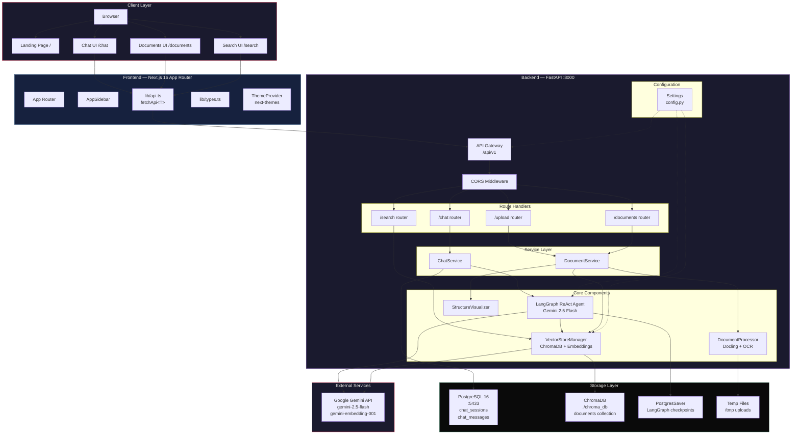

# System Overview — ArchiveAI

High-level view of the entire system showing all major subsystems and their relationships.

```mermaid
graph TB
    subgraph Client["Client Layer"]
        Browser["Browser"]
        LandingPage["Landing Page /"]
        ChatUI["Chat UI /chat"]
        DocUI["Documents UI /documents"]
        SearchUI["Search UI /search"]
    end

    subgraph Frontend["Frontend — Next.js 16 App Router"]
        AppRouter["App Router"]
        Sidebar["AppSidebar"]
        API["lib/api.ts<br/>fetchApi&lt;T&gt;"]
        Types["lib/types.ts"]
        ThemeProvider["ThemeProvider<br/>next-themes"]
    end

    subgraph Backend["Backend — FastAPI :8000"]
        APIGateway["API Gateway<br/>/api/v1"]
        CORS["CORS Middleware"]

        subgraph Routes["Route Handlers"]
            ChatRouter["/chat router"]
            UploadRouter["/upload router"]
            DocsRouter["/documents router"]
            SearchRouter["/search router"]
        end

        subgraph Services["Service Layer"]
            ChatService["ChatService"]
            DocService["DocumentService"]
        end

        subgraph Core["Core Components"]
            Agent["LangGraph ReAct Agent<br/>Gemini 2.5 Flash"]
            DocProcessor["DocumentProcessor<br/>Docling + OCR"]
            VSManager["VectorStoreManager<br/>ChromaDB + Embeddings"]
            StructureViz["StructureVisualizer"]
        end

        subgraph Config["Configuration"]
            Settings["Settings<br/>config.py"]
        end
    end

    subgraph Storage["Storage Layer"]
        PG["PostgreSQL 16<br/>:5433<br/>chat_sessions<br/>chat_messages"]
        Chroma["ChromaDB<br/>./chroma_db<br/>documents collection"]
        LangGraphCP["PostgresSaver<br/>LangGraph checkpoints"]
        TempFS["Temp Files<br/>/tmp uploads"]
    end

    subgraph External["External Services"]
        GeminiAPI["Google Gemini API<br/>gemini-2.5-flash<br/>gemini-embedding-001"]
    end

    Browser --> LandingPage
    Browser --> ChatUI
    Browser --> DocUI
    Browser --> SearchUI

    ChatUI --> API
    DocUI --> API
    SearchUI --> API
    API --> APIGateway

    APIGateway --> CORS
    CORS --> ChatRouter
    CORS --> UploadRouter
    CORS --> DocsRouter
    CORS --> SearchRouter

    ChatRouter --> ChatService
    UploadRouter --> DocService
    DocsRouter --> DocService
    SearchRouter --> VSManager

    ChatService --> Agent
    ChatService --> PG
    Agent --> VSManager
    Agent --> LangGraphCP
    Agent --> GeminiAPI

    DocService --> DocProcessor
    DocService --> VSManager
    DocService --> StructureViz
    DocProcessor --> TempFS
    VSManager --> Chroma
    VSManager --> GeminiAPI

    Settings -.-> APIGateway
    Settings -.-> VSManager
    Settings -.-> Agent

    style Client fill:#1a1a2e,stroke:#e94560,color:#f0f0ec
    style Frontend fill:#16213e,stroke:#0f3460,color:#f0f0ec
    style Backend fill:#1a1a2e,stroke:#533483,color:#f0f0ec
    style Storage fill:#0a0a0a,stroke:#2d6a4f,color:#f0f0ec
    style External fill:#1a1a2e,stroke:#e94560,color:#f0f0ec
```
