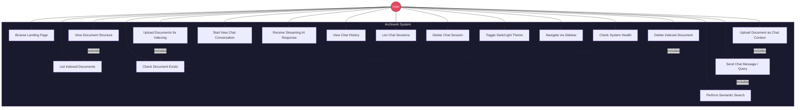

# Use Case Diagram — ArchiveAI

Shows all actors and their interactions with the system.

## Use Case Descriptions

| UC# | Use Case | Actor | Description |
|-----|----------|-------|-------------|
| UC1 | Browse Landing Page | User | View the marketing/hero page with features and stats |
| UC2 | Upload Documents for Indexing | User | Upload PDF, DOCX, PPTX, HTML, TXT, MD files to be chunked, embedded, and stored in ChromaDB |
| UC3 | Upload Document as Chat Context | User | Upload a file for in-chat context without permanent indexing |
| UC4 | List Indexed Documents | User | View all documents in the vector store with chunk counts |
| UC5 | Delete Indexed Document | User | Remove a document and all its chunks from ChromaDB |
| UC6 | View Document Structure | User | See Docling-extracted headings, tables, and images for a document |
| UC7 | Check Document Exists | User | Verify if a file has already been indexed (deduplication) |
| UC8 | Start New Chat Conversation | User | Begin a fresh chat session with a new session ID |
| UC9 | Send Chat Message / Query | User | Send a prompt to the RAG agent which searches documents and generates a response |
| UC10 | Receive Streaming AI Response | User | Receive tokens incrementally via SSE (infrastructure ready) |
| UC11 | View Chat History | User | Retrieve all messages in a conversation session |
| UC12 | List Chat Sessions | User | View all past chat sessions with timestamps |
| UC13 | Delete Chat Session | User | Remove a session and all its messages from PostgreSQL |
| UC14 | Perform Semantic Search | User | Direct similarity search against the vector store with configurable k results |
| UC15 | Toggle Dark/Light Theme | User | Switch between dark (default) and light mode |
| UC16 | Navigate via Sidebar | User | Use sidebar for recent chats, documents, and search navigation |
| UC17 | Check System Health | User/Admin | Hit /health endpoint to check vector store stats and model info |
