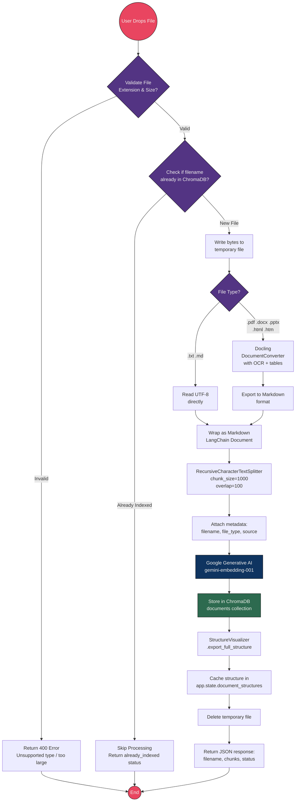
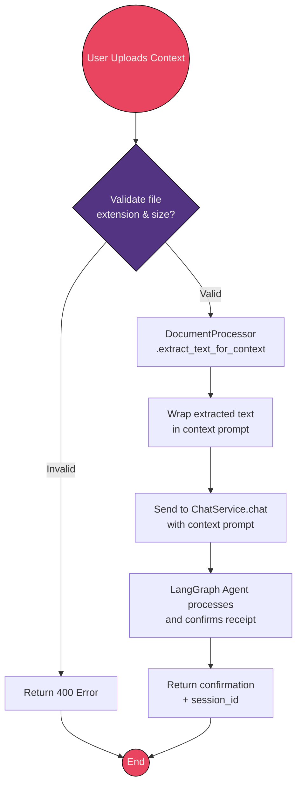

# Document Processing — Activity Diagram

Shows the detailed flow of document upload, processing, chunking, embedding, and indexing.

```mermaid
flowchart TD
    Start((User Drops File)) --> Validate{Validate File<br/>Extension & Size?}
    Validate -->|Invalid| Error400[Return 400 Error<br/>Unsupported type / too large]
    Validate -->|Valid| CheckExists{Check if filename<br/>already in ChromaDB?}

    CheckExists -->|Already Indexed| Skip[Skip Processing<br/>Return already_indexed status]
    CheckExists -->|New File| WriteTemp[Write bytes to<br/>temporary file]

    WriteTemp --> FileType{File Type?}

    FileType -->|.txt .md| ReadRaw[Read UTF-8<br/>directly]
    FileType -->|.pdf .docx .pptx<br/>.html .htm| DoclingConvert[Docling<br/>DocumentConverter<br/>with OCR + tables]

    ReadRaw --> ToMarkdown[Wrap as Markdown<br/>LangChain Document]
    DoclingConvert --> ExportMD[Export to Markdown<br/>format]

    ExportMD --> ToMarkdown
    ToMarkdown --> Chunk[RecursiveCharacterTextSplitter<br/>chunk_size=1000<br/>overlap=100]

    Chunk --> AddMeta[Attach metadata:<br/>filename, file_type, source]
    AddMeta --> Embed[Google Generative AI<br/>gemini-embedding-001]

    Embed --> StoreChroma[Store in ChromaDB<br/>documents collection]
    StoreChroma --> ExtractStructure[StructureVisualizer<br/>.export_full_structure]

    ExtractStructure --> CacheStructure[Cache structure in<br/>app.state.document_structures]
    CacheStructure --> CleanupTemp[Delete temporary file]
    CleanupTemp --> ReturnSuccess[Return JSON response:<br/>filename, chunks, status]

    Error400 --> End((End))
    Skip --> End
    ReturnSuccess --> End

    style Start fill:#e94560,stroke:#0a0a0a,color:#f0f0ec
    style End fill:#e94560,stroke:#0a0a0a,color:#f0f0ec
    style FileType fill:#533483,stroke:#0a0a0a,color:#f0f0ec
    style CheckExists fill:#533483,stroke:#0a0a0a,color:#f0f0ec
    style Validate fill:#533483,stroke:#0a0a0a,color:#f0f0ec
    style StoreChroma fill:#2d6a4f,stroke:#0a0a0a,color:#f0f0ec
    style Embed fill:#0f3460,stroke:#0a0a0a,color:#f0f0ec
```

## Context Upload (Non-Indexed) Flow

```mermaid
flowchart TD
    Start((User Uploads Context)) --> Validate{Validate file<br/>extension & size?}
    Validate -->|Invalid| Error400[Return 400 Error]
    Validate -->|Valid| ExtractText[DocumentProcessor<br/>.extract_text_for_context]

    ExtractText --> WrapPrompt[Wrap extracted text<br/>in context prompt]
    WrapPrompt --> SendAgent[Send to ChatService.chat<br/>with context prompt]
    SendAgent --> AgentResponse[LangGraph Agent processes<br/>and confirms receipt]
    AgentResponse --> Return[Return confirmation<br/>+ session_id]

    Error400 --> End((End))
    Return --> End

    style Start fill:#e94560,stroke:#0a0a0a,color:#f0f0ec
    style End fill:#e94560,stroke:#0a0a0a,color:#f0f0ec
    style Validate fill:#533483,stroke:#0a0a0a,color:#f0f0ec
```
