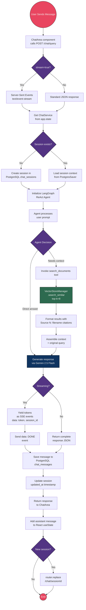

# Chat & RAG Pipeline — Activity Diagram

Shows the detailed flow of a chat query through the RAG agent pipeline.

```mermaid
flowchart TD
    Start((User Sends Message)) --> Frontend[ChatArea component<br/>calls POST /chat/query]
    Frontend --> StreamCheck{stream=true?}

    StreamCheck -->|Yes| SSE[Server-Sent Events<br/>text/event-stream]
    StreamCheck -->|No| Sync[Standard JSON response]

    SSE --> GetChatService[Get ChatService<br/>from app.state]
    Sync --> GetChatService

    GetChatService --> GetOrCreateSession{Session exists?}
    GetOrCreateSession -->|No| CreateSession[Create session in<br/>PostgreSQL chat_sessions]
    GetOrCreateSession -->|Yes| LoadSession[Load session context<br/>from PostgresSaver]

    CreateSession --> InitAgent[Initialize LangGraph<br/>ReAct Agent]
    LoadSession --> InitAgent

    InitAgent --> InvokeAgent[Agent processes<br/>user prompt]
    InvokeAgent --> AgentDecide{Agent Decision}

    AgentDecide -->|Needs context| CallSearch[Invoke search_documents tool]
    AgentDecide -->|Direct answer| GenerateLLM[Generate response<br/>via Gemini 2.5 Flash]

    CallSearch --> SearchVS[VectorStoreManager<br/>.search_similar<br/>top-k=8]
    SearchVS --> FormatResults[Format results with<br/>Source N: filename citations]
    FormatResults --> AssembleContext[Assemble context<br/>+ original query]
    AssembleContext --> GenerateLLM

    GenerateLLM --> StreamCheck2{Streaming?}
    StreamCheck2 -->|Yes| YieldTokens[Yield tokens<br/>as SSE events<br/>data: token, session_id]
    StreamCheck2 -->|No| ReturnFull[Return complete<br/>response JSON]

    YieldTokens --> DoneEvent[Send data: DONE<br/>event]
    DoneEvent --> SaveMsg[Save message to<br/>PostgreSQL chat_messages]
    ReturnFull --> SaveMsg

    SaveMsg --> UpdateTimestamp[Update session<br/>updated_at timestamp]
    UpdateTimestamp --> ReturnFrontend[Return response<br/>to ChatArea]

    ReturnFrontend --> AddToState[Add assistant message<br/>to React useState]
    AddToState --> UpdateURL{New session?}
    UpdateURL -->|Yes| RouterReplace[router.replace<br/>/chat/sessionId]
    UpdateURL -->|No| End((End))
    RouterReplace --> End

    style Start fill:#e94560,stroke:#0a0a0a,color:#f0f0ec
    style End fill:#e94560,stroke:#0a0a0a,color:#f0f0ec
    style AgentDecide fill:#533483,stroke:#0a0a0a,color:#f0f0ec
    style StreamCheck fill:#533483,stroke:#0a0a0a,color:#f0f0ec
    style StreamCheck2 fill:#533483,stroke:#0a0a0a,color:#f0f0ec
    style GetOrCreateSession fill:#533483,stroke:#0a0a0a,color:#f0f0ec
    style UpdateURL fill:#533483,stroke:#0a0a0a,color:#f0f0ec
    style SearchVS fill:#2d6a4f,stroke:#0a0a0a,color:#f0f0ec
    style GenerateLLM fill:#0f3460,stroke:#0a0a0a,color:#f0f0ec
```
