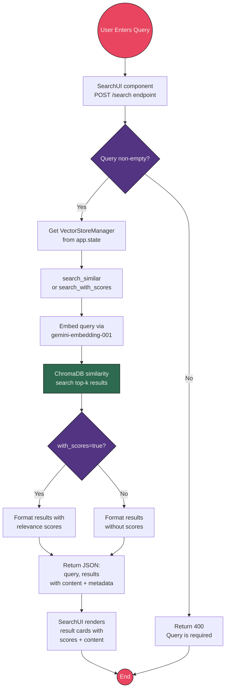

# Semantic Search — Activity Diagram

Shows the flow of a direct semantic search query (not through the chat agent).

```mermaid
flowchart TD
    Start((User Enters Query)) --> SearchUI[SearchUI component<br/>POST /search endpoint]
    SearchUI --> ValidateQuery{Query non-empty?}
    ValidateQuery -->|No| Error400[Return 400<br/>Query is required]
    ValidateQuery -->|Yes| GetVSM[Get VectorStoreManager<br/>from app.state]

    GetVSM --> SearchCall[search_similar<br/>or search_with_scores]
    SearchCall --> EmbedQuery[Embed query via<br/>gemini-embedding-001]
    EmbedQuery --> ChromaSearch[ChromaDB similarity<br/>search top-k results]

    ChromaSearch --> WithScores{with_scores=true?}
    WithScores -->|Yes| FormatScore[Format results with<br/>relevance scores]
    WithScores -->|No| FormatPlain[Format results<br/>without scores]

    FormatScore --> ReturnResults[Return JSON:<br/>query, results<br/>with content + metadata]
    FormatPlain --> ReturnResults

    ReturnResults --> DisplayCards[SearchUI renders<br/>result cards with<br/>scores + content]
    DisplayCards --> End((End))
    Error400 --> End

    style Start fill:#e94560,stroke:#0a0a0a,color:#f0f0ec
    style End fill:#e94560,stroke:#0a0a0a,color:#f0f0ec
    style ValidateQuery fill:#533483,stroke:#0a0a0a,color:#f0f0ec
    style WithScores fill:#533483,stroke:#0a0a0a,color:#f0f0ec
    style ChromaSearch fill:#2d6a4f,stroke:#0a0a0a,color:#f0f0ec
```
