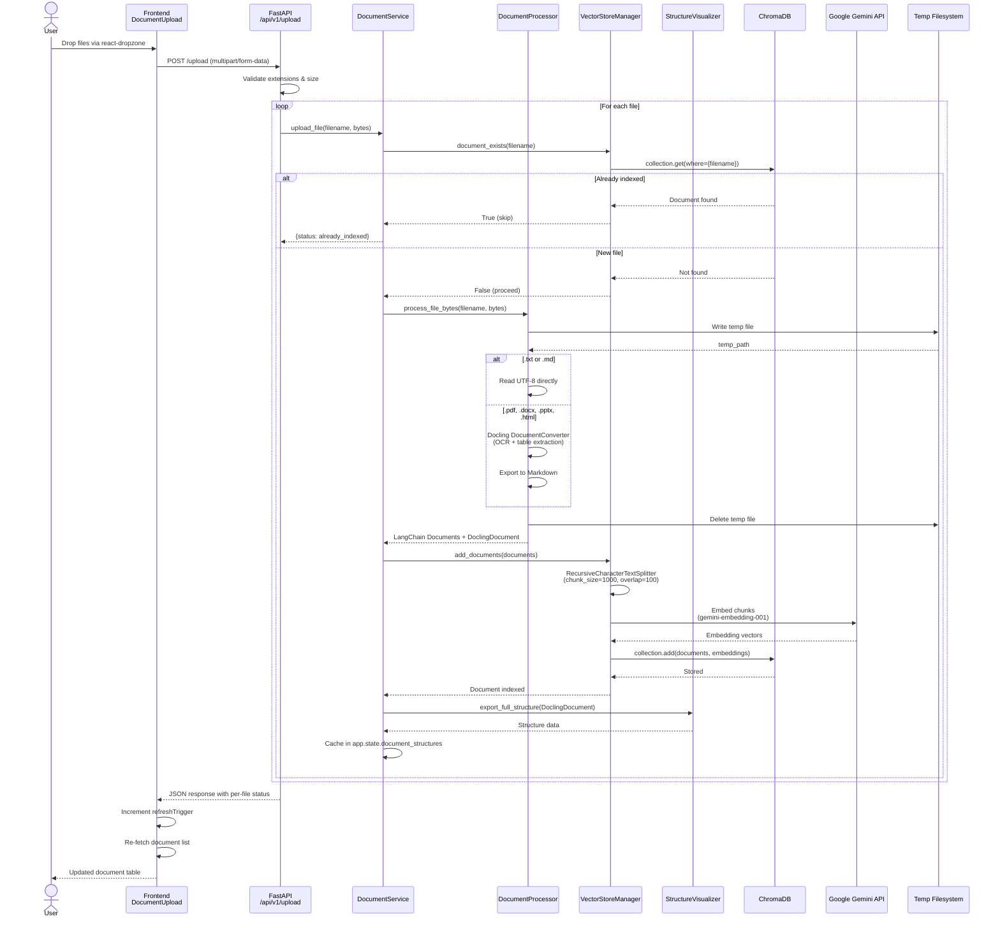

# Document Upload Sequence — Sequence Diagram

Shows the interactions between frontend, backend services, and storage during file upload.

```mermaid
sequenceDiagram
    actor User
    participant FE as Frontend<br/>DocumentUpload
    participant API as FastAPI<br/>/api/v1/upload
    participant DS as DocumentService
    participant DP as DocumentProcessor
    participant VSM as VectorStoreManager
    participant SV as StructureVisualizer
    participant Chroma as ChromaDB
    participant Gemini as Google Gemini API
    participant FS as Temp Filesystem

    User->>FE: Drop files via react-dropzone
    FE->>API: POST /upload (multipart/form-data)
    API->>API: Validate extensions & size

    loop For each file
        API->>DS: upload_file(filename, bytes)
        DS->>VSM: document_exists(filename)
        VSM->>Chroma: collection.get(where={filename})

        alt Already indexed
            Chroma-->>VSM: Document found
            VSM-->>DS: True (skip)
            DS-->>API: {status: already_indexed}
        else New file
            Chroma-->>VSM: Not found
            VSM-->>DS: False (proceed)

            DS->>DP: process_file_bytes(filename, bytes)
            DP->>FS: Write temp file
            FS-->>DP: temp_path

            alt .txt or .md
                DP->>DP: Read UTF-8 directly
            else .pdf, .docx, .pptx, .html
                DP->>DP: Docling DocumentConverter<br/>(OCR + table extraction)
                DP->>DP: Export to Markdown
            end

            DP->>FS: Delete temp file
            DP-->>DS: LangChain Documents + DoclingDocument

            DS->>VSM: add_documents(documents)
            VSM->>VSM: RecursiveCharacterTextSplitter<br/>(chunk_size=1000, overlap=100)
            VSM->>Gemini: Embed chunks<br/>(gemini-embedding-001)
            Gemini-->>VSM: Embedding vectors
            VSM->>Chroma: collection.add(documents, embeddings)
            Chroma-->>VSM: Stored
            VSM-->>DS: Document indexed

            DS->>SV: export_full_structure(DoclingDocument)
            SV-->>DS: Structure data
            DS->>DS: Cache in app.state.document_structures
        end
    end

    API-->>FE: JSON response with per-file status
    FE->>FE: Increment refreshTrigger
    FE->>FE: Re-fetch document list
    FE-->>User: Updated document table
```
