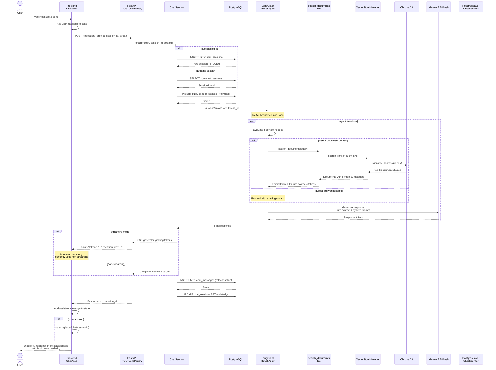

# Chat Query Sequence — Sequence Diagram

Shows the interactions during a chat query through the RAG agent pipeline.

```mermaid
sequenceDiagram
    actor User
    participant FE as Frontend<br/>ChatArea
    participant API as FastAPI<br/>POST /chat/query
    participant CS as ChatService
    participant PG as PostgreSQL
    participant Agent as LangGraph<br/>ReAct Agent
    participant Tool as search_documents<br/>Tool
    participant VSM as VectorStoreManager
    participant Chroma as ChromaDB
    participant LLM as Gemini 2.5 Flash
    participant CP as PostgresSaver<br/>Checkpointer

    User->>FE: Type message & send
    FE->>FE: Add user message to state
    FE->>API: POST /chat/query {prompt, session_id, stream}
    API->>CS: chat(prompt, session_id, stream)

    alt No session_id
        CS->>PG: INSERT INTO chat_sessions
        PG-->>CS: new session_id (UUID)
    else Existing session
        CS->>PG: SELECT from chat_sessions
        PG-->>CS: Session found
    end

    CS->>PG: INSERT INTO chat_messages (role=user)
    PG-->>CS: Saved

    CS->>Agent: ainvoke/invoke with thread_id

    Note over Agent: ReAct Agent Decision Loop

    loop Agent iterations
        Agent->>Agent: Evaluate if context needed

        alt Needs document context
            Agent->>Tool: search_documents(query)
            Tool->>VSM: search_similar(query, k=8)
            VSM->>Chroma: similarity_search(query, k)
            Chroma-->>VSM: Top-k document chunks
            VSM-->>Tool: Documents with content & metadata
            Tool-->>Agent: Formatted results with source citations
        else Direct answer possible
            Note over Agent: Proceed with existing context
        end

        Agent->>LLM: Generate response<br/>with context + system prompt
        LLM-->>Agent: Response tokens
    end

    Agent-->>CS: Final response

    alt Streaming mode
        CS-->>API: SSE generator yielding tokens
        API-->>FE: data: {"token": "...", "session_id": "..."}
        Note over FE: Infrastructure ready,<br/>currently uses non-streaming
    else Non-streaming
        CS-->>API: Complete response JSON
    end

    CS->>PG: INSERT INTO chat_messages (role=assistant)
    PG-->>CS: Saved
    CS->>PG: UPDATE chat_sessions SET updated_at

    API-->>FE: Response with session_id
    FE->>FE: Add assistant message to state

    alt New session
        FE->>FE: router.replace(/chat/sessionId)
    end

    FE-->>User: Display AI response in MessageBubble<br/>with Markdown rendering
```
