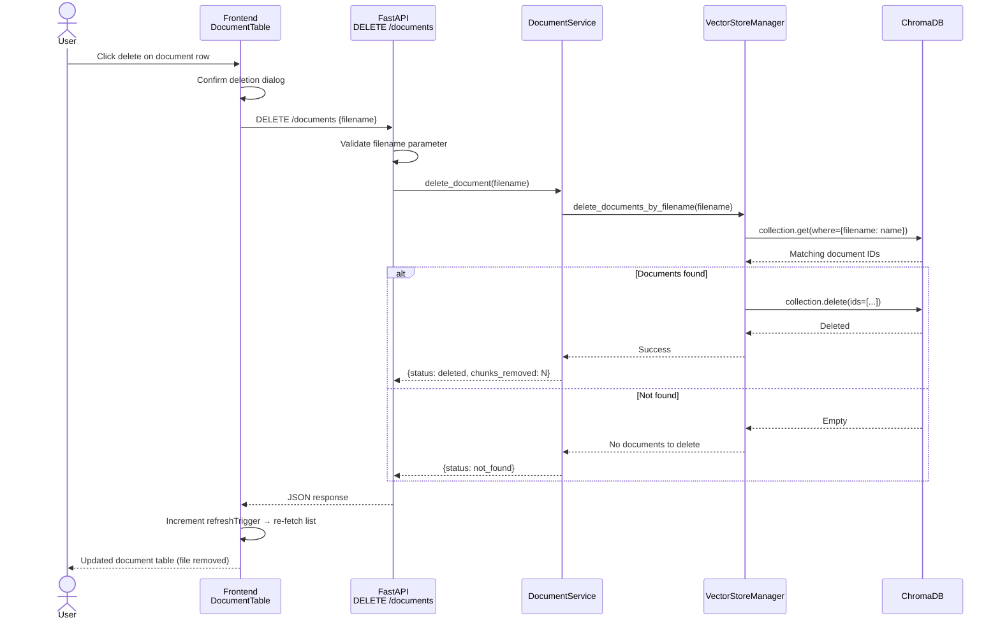

# Document Deletion Sequence — Sequence Diagram

Shows the interactions when deleting an indexed document.

```mermaid
sequenceDiagram
    actor User
    participant FE as Frontend<br/>DocumentTable
    participant API as FastAPI<br/>DELETE /documents
    participant DS as DocumentService
    participant VSM as VectorStoreManager
    participant Chroma as ChromaDB

    User->>FE: Click delete on document row
    FE->>FE: Confirm deletion dialog
    FE->>API: DELETE /documents {filename}

    API->>API: Validate filename parameter
    API->>DS: delete_document(filename)
    DS->>VSM: delete_documents_by_filename(filename)

    VSM->>Chroma: collection.get(where={filename: name})
    Chroma-->>VSM: Matching document IDs

    alt Documents found
        VSM->>Chroma: collection.delete(ids=[...])
        Chroma-->>VSM: Deleted
        VSM-->>DS: Success
        DS-->>API: {status: deleted, chunks_removed: N}
    else Not found
        Chroma-->>VSM: Empty
        VSM-->>DS: No documents to delete
        DS-->>API: {status: not_found}
    end

    API-->>FE: JSON response
    FE->>FE: Increment refreshTrigger → re-fetch list
    FE-->>User: Updated document table (file removed)
```
