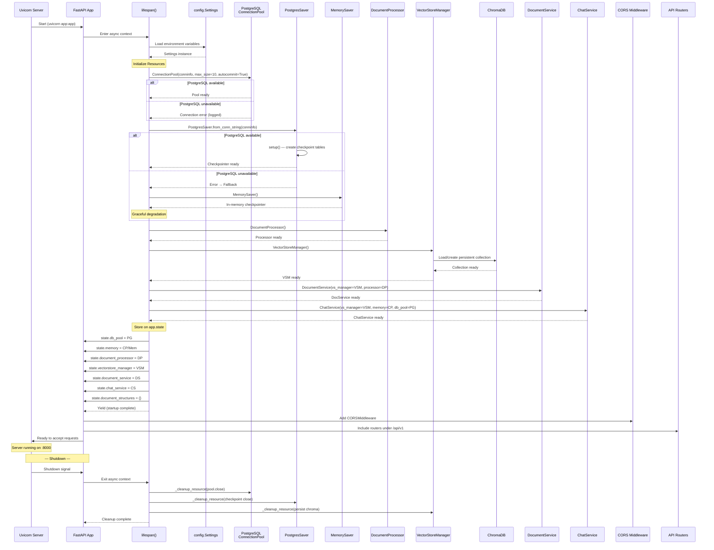

# App Startup & Initialization — Sequence Diagram

Shows the application startup lifecycle, resource initialization, and graceful shutdown.

```mermaid
sequenceDiagram
    participant Uvicorn as Uvicorn Server
    participant App as FastAPI App
    participant Lifespan as lifespan()
    participant Settings as config.Settings
    participant PG as PostgreSQL<br/>ConnectionPool
    participant CP as PostgresSaver
    participant Mem as MemorySaver
    participant DP as DocumentProcessor
    participant VSM as VectorStoreManager
    participant Chroma as ChromaDB
    participant DS as DocumentService
    participant CS as ChatService
    participant Middleware as CORS Middleware
    participant Router as API Routers

    Uvicorn->>App: Start (uvicorn app:app)
    App->>Lifespan: Enter async context

    Lifespan->>Settings: Load environment variables
    Settings-->>Lifespan: Settings instance

    Note over Lifespan: Initialize Resources

    Lifespan->>PG: ConnectionPool(conninfo, max_size=10, autocommit=True)
    alt PostgreSQL available
        PG-->>Lifespan: Pool ready
    else PostgreSQL unavailable
        PG-->>Lifespan: Connection error (logged)
    end

    Lifespan->>CP: PostgresSaver.from_conn_string(conninfo)
    alt PostgreSQL available
        CP->>CP: setup() — create checkpoint tables
        CP-->>Lifespan: Checkpointer ready
    else PostgreSQL unavailable
        CP-->>Lifespan: Error → Fallback
        Lifespan->>Mem: MemorySaver()
        Mem-->>Lifespan: In-memory checkpointer
        Note over Lifespan: Graceful degradation
    end

    Lifespan->>DP: DocumentProcessor()
    DP-->>Lifespan: Processor ready

    Lifespan->>VSM: VectorStoreManager()
    VSM->>Chroma: Load/create persistent collection
    Chroma-->>VSM: Collection ready
    VSM-->>Lifespan: VSM ready

    Lifespan->>DS: DocumentService(vs_manager=VSM, processor=DP)
    DS-->>Lifespan: DocService ready

    Lifespan->>CS: ChatService(vs_manager=VSM, memory=CP, db_pool=PG)
    CS-->>Lifespan: ChatService ready

    Note over Lifespan: Store on app.state

    Lifespan->>App: state.db_pool = PG
    Lifespan->>App: state.memory = CP/Mem
    Lifespan->>App: state.document_processor = DP
    Lifespan->>App: state.vectorstore_manager = VSM
    Lifespan->>App: state.document_service = DS
    Lifespan->>App: state.chat_service = CS
    Lifespan->>App: state.document_structures = {}

    Lifespan-->>App: Yield (startup complete)

    App->>Middleware: Add CORSMiddleware
    App->>Router: Include routers under /api/v1
    App->>Uvicorn: Ready to accept requests

    Note over Uvicorn: Server running on :8000

    Note over Uvicorn,App: --- Shutdown ---

    Uvicorn->>App: Shutdown signal
    App->>Lifespan: Exit async context
    Lifespan->>PG: _cleanup_resource(pool.close)
    Lifespan->>CP: _cleanup_resource(checkpoint close)
    Lifespan->>VSM: _cleanup_resource(persist chroma)
    Lifespan-->>App: Cleanup complete
```
