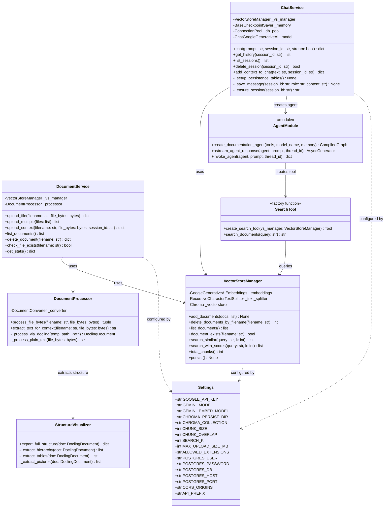

# Backend Class Diagram

Shows the main backend classes, their attributes, methods, and relationships.

```mermaid
classDiagram
    class Settings {
        +str GOOGLE_API_KEY
        +str GEMINI_MODEL
        +str GEMINI_EMBED_MODEL
        +str CHROMA_PERSIST_DIR
        +str CHROMA_COLLECTION
        +int CHUNK_SIZE
        +int CHUNK_OVERLAP
        +int SEARCH_K
        +int MAX_UPLOAD_SIZE_MB
        +str ALLOWED_EXTENSIONS
        +str POSTGRES_USER
        +str POSTGRES_PASSWORD
        +str POSTGRES_DB
        +str POSTGRES_HOST
        +str POSTGRES_PORT
        +str CORS_ORIGINS
        +str API_PREFIX
    }

    class DocumentProcessor {
        -DocumentConverter _converter
        +process_file_bytes(filename: str, file_bytes: bytes) tuple
        +extract_text_for_context(filename: str, file_bytes: bytes) str
        -_process_via_docling(temp_path: Path) DoclingDocument
        -_process_plain_text(file_bytes: bytes) str
    }

    class VectorStoreManager {
        -GoogleGenerativeAIEmbeddings _embeddings
        -RecursiveCharacterTextSplitter _text_splitter
        -Chroma _vectorstore
        +add_documents(docs: list) None
        +delete_documents_by_filename(filename: str) int
        +list_documents() list
        +document_exists(filename: str) bool
        +search_similar(query: str, k: int) list
        +search_with_scores(query: str, k: int) list
        +total_chunks() int
        +persist() None
    }

    class StructureVisualizer {
        +export_full_structure(doc: DoclingDocument) dict
        -_extract_hierarchy(doc: DoclingDocument) list
        -_extract_tables(doc: DoclingDocument) list
        -_extract_pictures(doc: DoclingDocument) list
    }

    class DocumentService {
        -VectorStoreManager _vs_manager
        -DocumentProcessor _processor
        +upload_file(filename: str, file_bytes: bytes) dict
        +upload_multiple(files: list) list
        +upload_context(filename: str, file_bytes: bytes, session_id: str) dict
        +list_documents() list
        +delete_document(filename: str) dict
        +check_file_exists(filename: str) bool
        +get_stats() dict
    }

    class ChatService {
        -VectorStoreManager _vs_manager
        -BaseCheckpointSaver _memory
        -ConnectionPool _db_pool
        -ChatGoogleGenerativeAI _model
        +chat(prompt: str, session_id: str, stream: bool) dict
        +get_history(session_id: str) list
        +list_sessions() list
        +delete_session(session_id: str) bool
        +add_context_to_chat(text: str, session_id: str) dict
        -_setup_persistence_tables() None
        -_save_message(session_id: str, role: str, content: str) None
        -_ensure_session(session_id: str) str
    }

    class AgentModule {
        <<module>>
        +create_documentation_agent(tools, model_name, memory) CompiledGraph
        +astream_agent_response(agent, prompt, thread_id) AsyncGenerator
        +invoke_agent(agent, prompt, thread_id) dict
    }

    class SearchTool {
        <<factory function>>
        +create_search_tool(vs_manager: VectorStoreManager) Tool
        +search_documents(query: str) str
    }

    DocumentService --> VectorStoreManager : uses
    DocumentService --> DocumentProcessor : uses
    ChatService --> VectorStoreManager : uses
    ChatService --> AgentModule : creates agent
    AgentModule --> SearchTool : creates tool
    SearchTool --> VectorStoreManager : queries
    DocumentProcessor --> StructureVisualizer : extracts structure
    VectorStoreManager ..> Settings : configured by
    ChatService ..> Settings : configured by
    DocumentService ..> Settings : configured by
```
