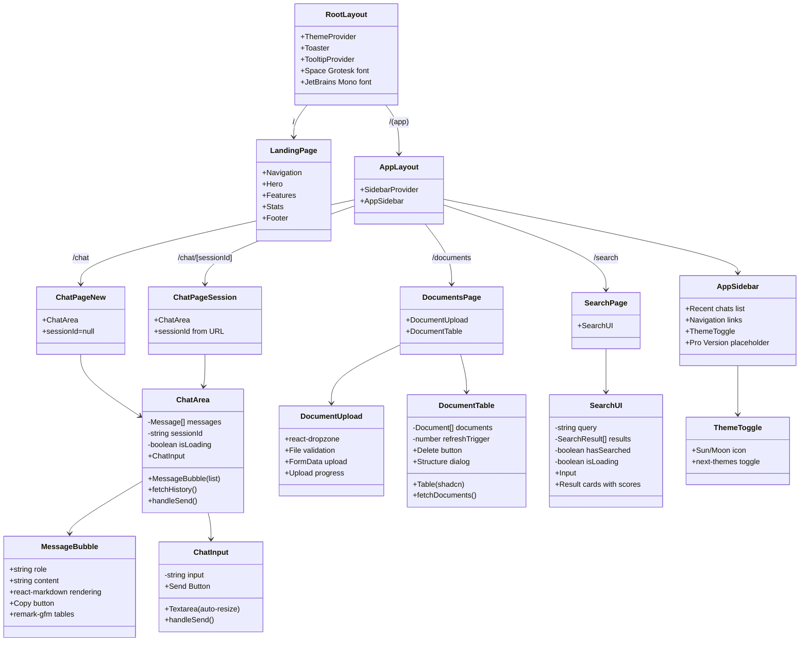

# Frontend Component Diagram

Shows the React/Next.js component hierarchy and their relationships.

```mermaid
classDiagram
    class RootLayout {
        +ThemeProvider
        +Toaster
        +TooltipProvider
        +Space Grotesk font
        +JetBrains Mono font
    }

    class LandingPage {
        +Navigation
        +Hero
        +Features
        +Stats
        +Footer
    }

    class AppLayout {
        +SidebarProvider
        +AppSidebar
    }

    class AppSidebar {
        +Recent chats list
        +Navigation links
        +ThemeToggle
        +Pro Version placeholder
    }

    class ChatPageNew {
        +ChatArea
        +sessionId=null
    }

    class ChatPageSession {
        +ChatArea
        +sessionId from URL
    }

    class ChatArea {
        -Message[] messages
        -string sessionId
        -boolean isLoading
        +MessageBubble (list)
        +ChatInput
        +fetchHistory()
        +handleSend()
    }

    class ChatInput {
        -string input
        +Textarea (auto-resize)
        +Send Button
        +handleSend()
    }

    class MessageBubble {
        +string role
        +string content
        +react-markdown rendering
        +Copy button
        +remark-gfm tables
    }

    class DocumentsPage {
        +DocumentUpload
        +DocumentTable
    }

    class DocumentUpload {
        +react-dropzone
        +File validation
        +FormData upload
        +Upload progress
    }

    class DocumentTable {
        -Document[] documents
        -number refreshTrigger
        +Table (shadcn)
        +Delete button
        +Structure dialog
        +fetchDocuments()
    }

    class SearchPage {
        +SearchUI
    }

    class SearchUI {
        -string query
        -SearchResult[] results
        -boolean hasSearched
        -boolean isLoading
        +Input
        +Result cards with scores
    }

    class ThemeToggle {
        +Sun/Moon icon
        +next-themes toggle
    }

    RootLayout --> LandingPage : /
    RootLayout --> AppLayout : /(app)
    AppLayout --> AppSidebar
    AppLayout --> ChatPageNew : /chat
    AppLayout --> ChatPageSession : /chat/[sessionId]
    AppLayout --> DocumentsPage : /documents
    AppLayout --> SearchPage : /search

    ChatPageNew --> ChatArea
    ChatPageSession --> ChatArea
    ChatArea --> MessageBubble
    ChatArea --> ChatInput
    DocumentsPage --> DocumentUpload
    DocumentsPage --> DocumentTable
    SearchPage --> SearchUI
    AppSidebar --> ThemeToggle
```
