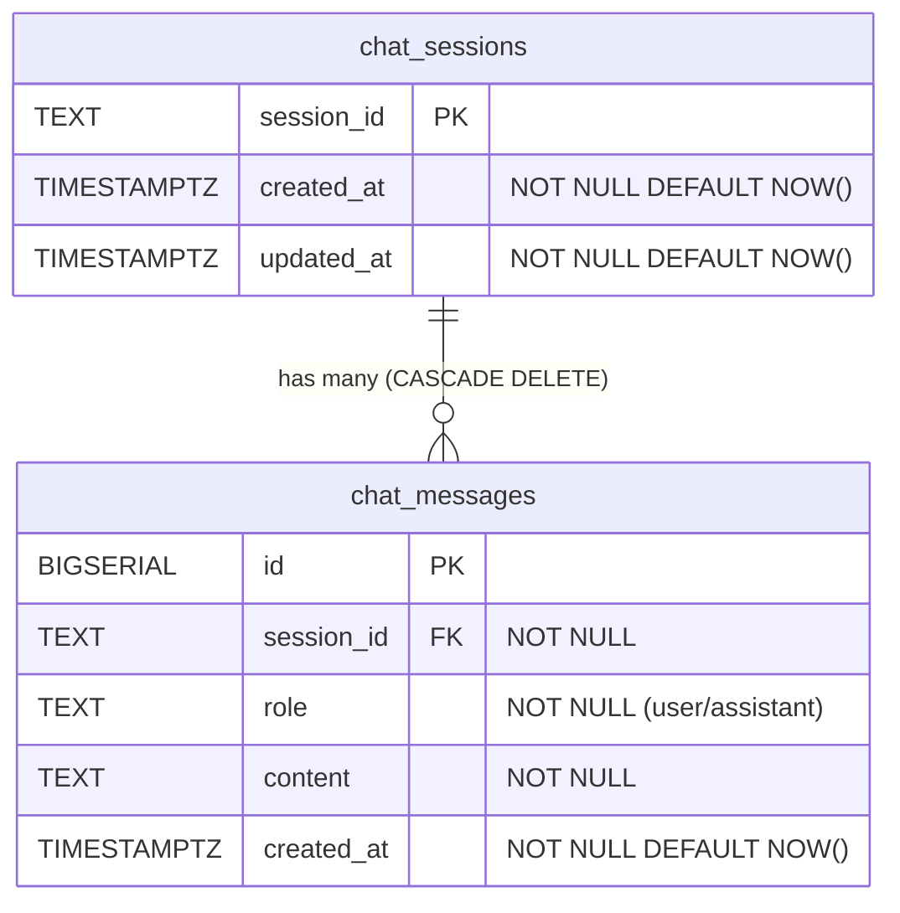
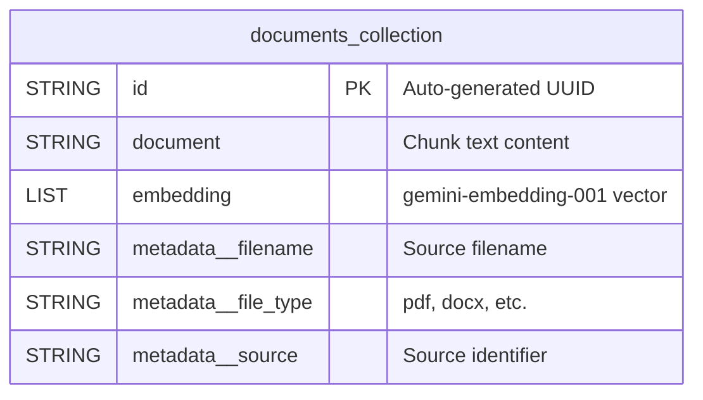
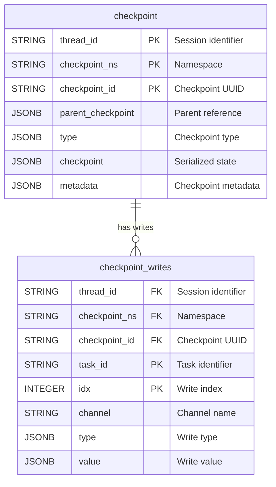

# Database Schema — ER Diagram

Shows the PostgreSQL database schema and ChromaDB document structure.

```mermaid
erDiagram
    chat_sessions {
        TEXT session_id PK
        TIMESTAMPTZ created_at "NOT NULL DEFAULT NOW()"
        TIMESTAMPTZ updated_at "NOT NULL DEFAULT NOW()"
    }

    chat_messages {
        BIGSERIAL id PK
        TEXT session_id FK "NOT NULL"
        TEXT role "NOT NULL (user/assistant)"
        TEXT content "NOT NULL"
        TIMESTAMPTZ created_at "NOT NULL DEFAULT NOW()"
    }

    chat_sessions ||--o{ chat_messages : "has many (CASCADE DELETE)"

    %% Index on chat_messages
    %% idx_chat_messages_session_created ON (session_id, created_at, id)
```

## ChromaDB Document Collection Schema

```mermaid
erDiagram
    documents_collection {
        STRING id PK "Auto-generated UUID"
        STRING document "Chunk text content"
        LIST embedding "gemini-embedding-001 vector"
        STRING metadata__filename "Source filename"
        STRING metadata__file_type "pdf, docx, etc."
        STRING metadata__source "Source identifier"
    }

    %% Each document chunk has these metadata fields
    %% Chunking: RecursiveCharacterTextSplitter
    %%   chunk_size: 1000
    %%   overlap: 100
```

## LangGraph Checkpoint Tables (Auto-created)

```mermaid
erDiagram
    checkpoint {
        STRING thread_id PK "Session identifier"
        STRING checkpoint_ns PK "Namespace"
        STRING checkpoint_id PK "Checkpoint UUID"
        JSONB parent_checkpoint "Parent reference"
        JSONB type "Checkpoint type"
        JSONB checkpoint "Serialized state"
        JSONB metadata "Checkpoint metadata"
    }

    checkpoint_writes {
        STRING thread_id FK "Session identifier"
        STRING checkpoint_ns FK "Namespace"
        STRING checkpoint_id FK "Checkpoint UUID"
        STRING task_id PK "Task identifier"
        INTEGER idx PK "Write index"
        STRING channel "Channel name"
        JSONB type "Write type"
        JSONB value "Write value"
    }

    checkpoint ||--o{ checkpoint_writes : "has writes"
```
