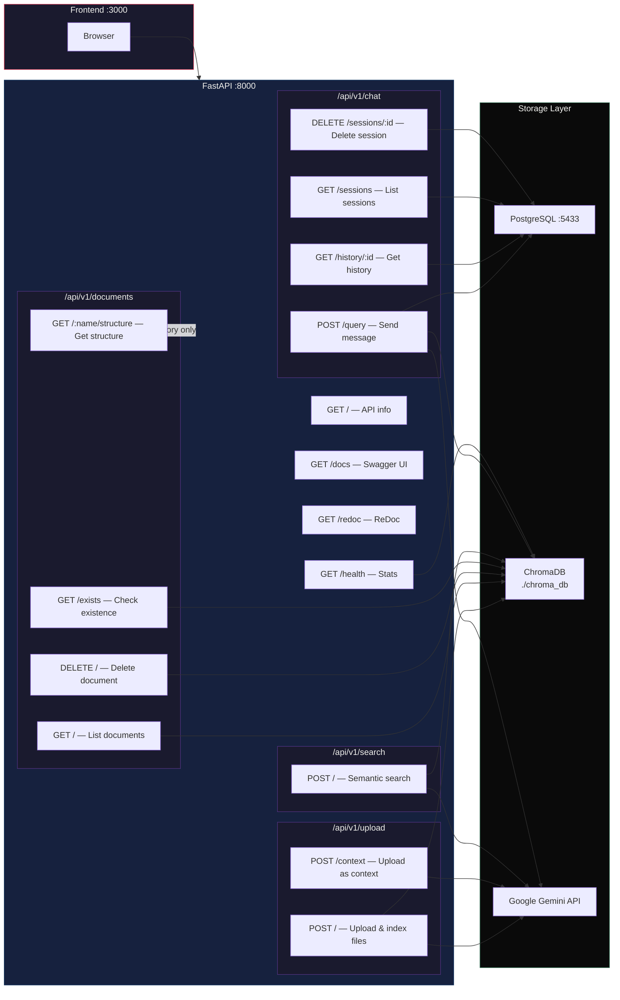

# API Endpoint Map — Deployment Diagram

Shows all API endpoints, their methods, and the infrastructure they connect to.

```mermaid
graph LR
    subgraph Client["Frontend :3000"]
        Browser["Browser"]
    end

    subgraph API["FastAPI :8000"]
        Root["GET / — API info"]
        Health["GET /health — Stats"]
        Swagger["GET /docs — Swagger UI"]
        Redoc["GET /redoc — ReDoc"]

        subgraph Upload["/api/v1/upload"]
            U1["POST / — Upload & index files"]
            U2["POST /context — Upload as context"]
        end

        subgraph Documents["/api/v1/documents"]
            D1["GET / — List documents"]
            D2["DELETE / — Delete document"]
            D3["GET /exists — Check existence"]
            D4["GET /:name/structure — Get structure"]
        end

        subgraph Search["/api/v1/search"]
            S1["POST / — Semantic search"]
        end

        subgraph Chat["/api/v1/chat"]
            C1["POST /query — Send message"]
            C2["GET /history/:id — Get history"]
            C3["GET /sessions — List sessions"]
            C4["DELETE /sessions/:id — Delete session"]
        end
    end

    subgraph Storage["Storage Layer"]
        PG["PostgreSQL :5433"]
        Chroma["ChromaDB<br/>./chroma_db"]
        Gemini["Google Gemini API"]
    end

    Browser --> API
    U1 --> Chroma
    U1 --> Gemini
    U2 --> Gemini
    D1 --> Chroma
    D2 --> Chroma
    D3 --> Chroma
    D4 -.->|"in-memory only"| API
    S1 --> Chroma
    S1 --> Gemini
    C1 --> PG
    C1 --> Chroma
    C1 --> Gemini
    C2 --> PG
    C3 --> PG
    C4 --> PG
    Health --> Chroma

    style Client fill:#1a1a2e,stroke:#e94560,color:#f0f0ec
    style API fill:#16213e,stroke:#0f3460,color:#f0f0ec
    style Storage fill:#0a0a0a,stroke:#2d6a4f,color:#f0f0ec
    style Upload fill:#1a1a2e,stroke:#533483,color:#f0f0ec
    style Documents fill:#1a1a2e,stroke:#533483,color:#f0f0ec
    style Search fill:#1a1a2e,stroke:#533483,color:#f0f0ec
    style Chat fill:#1a1a2e,stroke:#533483,color:#f0f0ec
```
