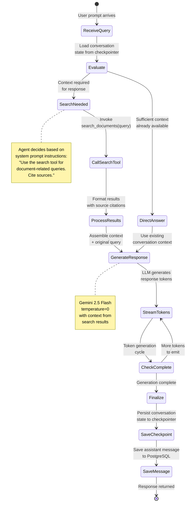

# RAG Agent Internal State Machine — State Diagram

Shows the LangGraph ReAct agent's internal state transitions during query processing.

```mermaid
stateDiagram-v2
    [*] --> ReceiveQuery: User prompt arrives

    ReceiveQuery --> Evaluate: Load conversation<br/>state from checkpointer

    Evaluate --> SearchNeeded: Context required<br/>for response
    Evaluate --> DirectAnswer: Sufficient context<br/>already available

    SearchNeeded --> CallSearchTool: Invoke<br/>search_documents(query)
    CallSearchTool --> ProcessResults: Format results<br/>with source citations
    ProcessResults --> GenerateResponse: Assemble context<br/>+ original query

    DirectAnswer --> GenerateResponse: Use existing<br/>conversation context

    GenerateResponse --> StreamTokens: LLM generates<br/>response tokens
    StreamTokens --> CheckComplete: Token generation<br/>cycle

    CheckComplete --> StreamTokens: More tokens<br/>to emit
    CheckComplete --> Finalize: Generation complete

    Finalize --> SaveCheckpoint: Persist conversation<br/>state to checkpointer
    SaveCheckpoint --> SaveMessage: Save assistant message<br/>to PostgreSQL
    SaveMessage --> [*]: Response returned

    note right of SearchNeeded
        Agent decides based on
        system prompt instructions:
        "Use the search tool for
        document-related queries.
        Cite sources."
    end note

    note right of GenerateResponse
        Gemini 2.5 Flash
        temperature=0
        with context from
        search results
    end note
```
