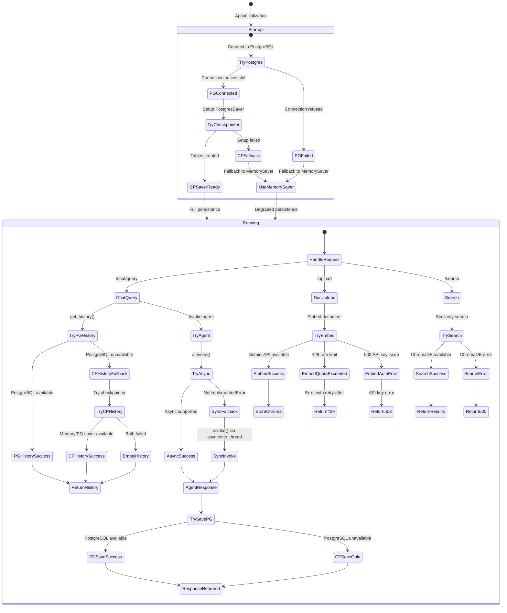

# Graceful Degradation & Fallback — State Diagram

Shows how the system handles failures and degrades gracefully.

```mermaid
stateDiagram-v2
    [*] --> Startup: App initialization

    state Startup {
        [*] --> TryPostgres: Connect to PostgreSQL
        TryPostgres --> PGConnected: Connection successful
        TryPostgres --> PGFailed: Connection refused

        PGConnected --> TryCheckpointer: Setup PostgresSaver
        TryCheckpointer --> CPSaverReady: Tables created
        TryCheckpointer --> CPFallback: Setup failed

        PGFailed --> UseMemorySaver: Fallback to MemorySaver
        CPFallback --> UseMemorySaver: Fallback to MemorySaver
    }

    CPSaverReady --> Running: Full persistence
    UseMemorySaver --> Running: Degraded persistence

    state Running {
        [*] --> HandleRequest

        HandleRequest --> ChatQuery: /chat/query
        HandleRequest --> DocUpload: /upload
        HandleRequest --> Search: /search

        ChatQuery --> TryPGHistory: get_history()
        TryPGHistory --> PGHistorySuccess: PostgreSQL available
        TryPGHistory --> CPHistoryFallback: PostgreSQL unavailable
        PGHistorySuccess --> ReturnHistory
        CPHistoryFallback --> TryCPHistory: Try checkpointer
        TryCPHistory --> CPHistorySuccess: Memory/PG saver available
        TryCPHistory --> EmptyHistory: Both failed
        CPHistorySuccess --> ReturnHistory
        EmptyHistory --> ReturnHistory

        DocUpload --> TryEmbed: Embed document
        TryEmbed --> EmbedSuccess: Gemini API available
        TryEmbed --> EmbedQuotaExceeded: 429 rate limit
        TryEmbed --> EmbedAuthError: 503 API key issue
        EmbedSuccess --> StoreChroma
        EmbedQuotaExceeded --> Return429: Error with retry-after
        EmbedAuthError --> Return503: API key error

        Search --> TrySearch: Similarity search
        TrySearch --> SearchSuccess: ChromaDB available
        TrySearch --> SearchError: ChromaDB error
        SearchSuccess --> ReturnResults
        SearchError --> Return500

        ChatQuery --> TryAgent: Invoke agent
        TryAgent --> TryAsync: ainvoke()
        TryAsync --> AsyncSuccess: Async supported
        TryAsync --> SyncFallback: NotImplementedError
        SyncFallback --> SyncInvoke: invoke() via asyncio.to_thread
        AsyncSuccess --> AgentResponse
        SyncInvoke --> AgentResponse
        AgentResponse --> TrySavePG
        TrySavePG --> PDSaveSuccess: PostgreSQL available
        TrySavePG --> CPSaveOnly: PostgreSQL unavailable
        PDSaveSuccess --> ResponseReturned
        CPSaveOnly --> ResponseReturned
    }
```
