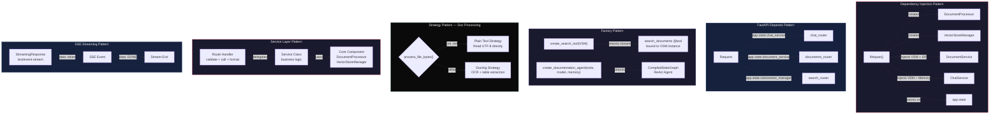

# Design Patterns — Object Diagram

Shows how the key design patterns are implemented with concrete object instances.

```mermaid
graph TB
    subgraph DependencyInjection["Dependency Injection Pattern"]
        Lifespan["lifespan()"]
        Lifespan --> |"creates"| DP_inst["DocumentProcessor"]
        Lifespan --> |"creates"| VSM_inst["VectorStoreManager"]
        Lifespan --> |"injects VSM + DP"| DS_inst["DocumentService"]
        Lifespan --> |"injects VSM + Memory"| CS_inst["ChatService"]
        Lifespan --> |"stores on"| AppState["app.state"]
    end

    subgraph FastAPIDepends["FastAPI Depends Pattern"]
        Request["Request"]
        Request --> |"app.state.chat_service"| RouteChat["chat_router"]
        Request --> |"app.state.document_service"| RouteDocs["documents_router"]
        Request --> |"app.state.vectorstore_manager"| RouteSearch["search_router"]
    end

    subgraph FactoryPattern["Factory Pattern"]
        CreateTool["create_search_tool(VSM)"]
        CreateTool --> |"returns closure"| SearchTool["search_documents @tool<br/>bound to VSM instance"]
        CreateAgent["create_documentation_agent(tools, model, memory)"]
        CreateAgent --> |"returns"| CompiledGraph["CompiledStateGraph<br/>ReAct Agent"]
    end

    subgraph StrategyPattern["Strategy Pattern — Doc Processing"]
        StrategyRouter{"process_file_bytes()"}
        StrategyRouter --> |".txt .md"| PlainTextStrategy["Plain Text Strategy<br/>Read UTF-8 directly"]
        StrategyRouter --> |"other"| DoclingStrategy["Docling Strategy<br/>OCR + table extraction"]
    end

    subgraph ServiceLayer["Service Layer Pattern"]
        ThinRoute["Route Handler<br/>validate + call + format"]
        ThinRoute --> |"delegates"| ServiceClass["Service Class<br/>business logic"]
        ServiceClass --> |"uses"| CoreComponent["Core Component<br/>DocumentProcessor<br/>VectorStoreManager"]
    end

    subgraph SSEStreaming["SSE Streaming Pattern"]
        SSEBackend["StreamingResponse<br/>text/event-stream"]
        SSEBackend --> |"data: token"| SSEEvent["SSE Event"]
        SSEEvent --> |"data: DONE"| SSEEnd["Stream End"]
    end

    style DependencyInjection fill:#1a1a2e,stroke:#e94560,color:#f0f0ec
    style FastAPIDepends fill:#16213e,stroke:#0f3460,color:#f0f0ec
    style FactoryPattern fill:#1a1a2e,stroke:#533483,color:#f0f0ec
    style StrategyPattern fill:#0a0a0a,stroke:#2d6a4f,color:#f0f0ec
    style ServiceLayer fill:#1a1a2e,stroke:#e94560,color:#f0f0ec
    style SSEStreaming fill:#16213e,stroke:#0f3460,color:#f0f0ec
```
