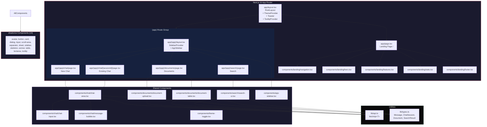

# Frontend Routing & Layout — Package Diagram

Shows the Next.js App Router structure, route groups, and layout nesting.

```mermaid
graph TB
    subgraph AppRouter["Next.js 16 App Router"]
        RootLayout["app/layout.tsx<br/>RootLayout<br/>+ ThemeProvider<br/>+ Toaster<br/>+ TooltipProvider"]

        LandingRoute["app/page.tsx<br/>Landing Page /"]
        LandingRoute --> Navigation["components/landing/navigation.tsx"]
        LandingRoute --> Hero["components/landing/hero.tsx"]
        LandingRoute --> Features["components/landing/features.tsx"]
        LandingRoute --> Stats["components/landing/stats.tsx"]
        LandingRoute --> Footer["components/landing/footer.tsx"]

        subgraph AppGroup["(app) Route Group"]
            AppGroupLayout["app/(app)/layout.tsx<br/>SidebarProvider<br/>+ AppSidebar"]

            ChatNewRoute["app/(app)/chat/page.tsx<br/>New Chat"]
            ChatSessionRoute["app/(app)/chat/[sessionId]/page.tsx<br/>Existing Chat"]

            DocsRoute["app/(app)/documents/page.tsx<br/>Documents"]
            SearchRoute["app/(app)/search/page.tsx<br/>Search"]
        end
    end

    subgraph SharedComponents["Shared Components"]
        ChatAreaComp["components/chat/chat-area.tsx"]
        ChatInputComp["components/chat/chat-input.tsx"]
        MessageBubbleComp["components/chat/message-bubble.tsx"]
        DocUploadComp["components/documents/document-upload.tsx"]
        DocTableComp["components/documents/document-table.tsx"]
        SearchUIComp["components/search/search-ui.tsx"]
        SidebarComp["components/app-sidebar.tsx"]
        ThemeToggleComp["components/theme-toggle.tsx"]
    end

    subgraph Utilities["Utilities"]
        APIClient["lib/api.ts<br/>fetchApi&lt;T&gt;"]
        TypesFile["lib/types.ts<br/>Message, ChatSession,<br/>Document, SearchResult"]
    end

    subgraph UI["shadcn/ui Components (14)"]
        UIComponents["avatar, button, card,<br/>dialog, input, scroll-area,<br/>separator, sheet, sidebar,<br/>skeleton, sonner, table,<br/>textarea, tooltip"]
    end

    RootLayout --> LandingRoute
    RootLayout --> AppGroup

    AppGroupLayout --> SidebarComp
    AppGroupLayout --> ChatNewRoute
    AppGroupLayout --> ChatSessionRoute
    AppGroupLayout --> DocsRoute
    AppGroupLayout --> SearchRoute

    ChatNewRoute --> ChatAreaComp
    ChatSessionRoute --> ChatAreaComp
    ChatAreaComp --> ChatInputComp
    ChatAreaComp --> MessageBubbleComp

    DocsRoute --> DocUploadComp
    DocsRoute --> DocTableComp

    SearchRoute --> SearchUIComp

    ChatAreaComp --> APIClient
    DocUploadComp --> APIClient
    DocTableComp --> APIClient
    SearchUIComp --> APIClient

    ChatAreaComp --> TypesFile
    DocTableComp --> TypesFile
    SearchUIComp --> TypesFile

    AllComponents --> UI

    style AppRouter fill:#1a1a2e,stroke:#e94560,color:#f0f0ec
    style AppGroup fill:#16213e,stroke:#0f3460,color:#f0f0ec
    style SharedComponents fill:#1a1a2e,stroke:#533483,color:#f0f0ec
    style Utilities fill:#0a0a0a,stroke:#2d6a4f,color:#f0f0ec
    style UI fill:#1a1a2e,stroke:#e94560,color:#f0f0ec
```
