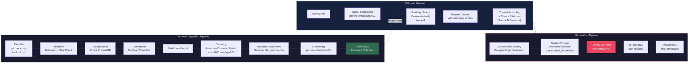

# Data Flow — Full RAG Pipeline Diagram

Shows the complete data flow from document ingestion to chat response, including all transformation steps.

```mermaid
flowchart LR
    subgraph Ingestion["Document Ingestion Pipeline"]
        RawFile["Raw File<br/>.pdf .docx .pptx<br/>.html .txt .md"]
        Validation["Validation<br/>Extension + Size Check"]
        Deduplication["Deduplication<br/>Check ChromaDB"]
        Conversion["Conversion<br/>Docling / Plain Text"]
        Markdown["Markdown Output"]
        Chunking["Chunking<br/>RecursiveCharacterSplitter<br/>size=1000 overlap=100"]
        Metadata["Metadata Attachment<br/>filename, file_type, source"]
        Embedding["Embedding<br/>gemini-embedding-001"]
        VectorStore["ChromaDB<br/>Persistent Collection"]
    end

    subgraph Retrieval["Retrieval Pipeline"]
        UserQuery["User Query"]
        QueryEmbed["Query Embedding<br/>gemini-embedding-001"]
        SimilaritySearch["Similarity Search<br/>Cosine similarity<br/>top-k=8"]
        RankedChunks["Ranked Chunks<br/>with relevance scores"]
        ContextAssembly["Context Assembly<br/>+ Source Citations<br/>[Source N: filename]"]
    end

    subgraph Generation["Generation Pipeline"]
        SystemPrompt["System Prompt<br/>ArchiveAI Assistant<br/>Cite sources, be concise"]
        ConversationHistory["Conversation History<br/>PostgresSaver checkpoint"]
        LLM["Gemini 2.5 Flash<br/>temperature=0"]
        Response["AI Response<br/>with citations"]
        Persistence["PostgreSQL<br/>chat_messages"]
    end

    RawFile --> Validation --> Deduplication --> Conversion --> Markdown --> Chunking --> Metadata --> Embedding --> VectorStore

    UserQuery --> QueryEmbed --> SimilaritySearch
    VectorStore -.->|"vector index"| SimilaritySearch
    SimilaritySearch --> RankedChunks --> ContextAssembly

    ContextAssembly --> SystemPrompt
    ConversationHistory --> SystemPrompt
    SystemPrompt --> LLM --> Response --> Persistence

    style Ingestion fill:#1a1a2e,stroke:#2d6a4f,color:#f0f0ec
    style Retrieval fill:#16213e,stroke:#0f3460,color:#f0f0ec
    style Generation fill:#1a1a2e,stroke:#e94560,color:#f0f0ec
    style VectorStore fill:#2d6a4f,stroke:#0a0a0a,color:#f0f0ec
    style LLM fill:#e94560,stroke:#0a0a0a,color:#f0f0ec
```
