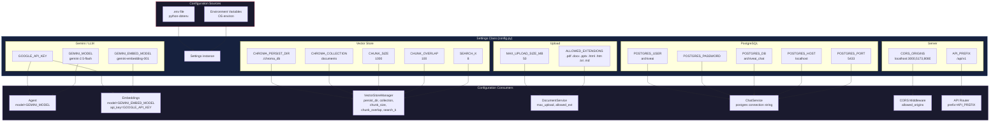

# Configuration & Environment — Object Diagram

Shows how configuration flows from environment variables through the Settings class to all system components.

```mermaid
graph TB
    subgraph Sources["Configuration Sources"]
        EnvFile[".env file<br/>python-dotenv"]
        EnvVars["Environment Variables<br/>OS environ"]
    end

    subgraph Config["Settings Class (config.py)"]
        SettingsObj["Settings instance"]

        subgraph GeminiConfig["Gemini / LLM"]
            GoogleAPIKey["GOOGLE_API_KEY"]
            GeminiModel["GEMINI_MODEL<br/>gemini-2.5-flash"]
            GeminiEmbedModel["GEMINI_EMBED_MODEL<br/>gemini-embedding-001"]
        end

        subgraph VectorConfig["Vector Store"]
            ChromaPersist["CHROMA_PERSIST_DIR<br/>./chroma_db"]
            ChromaCollection["CHROMA_COLLECTION<br/>documents"]
            ChunkSize["CHUNK_SIZE<br/>1000"]
            ChunkOverlap["CHUNK_OVERLAP<br/>100"]
            SearchK["SEARCH_K<br/>8"]
        end

        subgraph UploadConfig["Upload"]
            MaxUpload["MAX_UPLOAD_SIZE_MB<br/>50"]
            AllowedExt["ALLOWED_EXTENSIONS<br/>.pdf .docx .pptx .html .htm .txt .md"]
        end

        subgraph DBConfig["PostgreSQL"]
            PGUser["POSTGRES_USER<br/>archiveai"]
            PGPass["POSTGRES_PASSWORD"]
            PGDB["POSTGRES_DB<br/>archiveai_chat"]
            PGHost["POSTGRES_HOST<br/>localhost"]
            PGPort["POSTGRES_PORT<br/>5433"]
        end

        subgraph ServerConfig["Server"]
            CORS["CORS_ORIGINS<br/>localhost:3000,5173,8080"]
            APIPrefix["API_PREFIX<br/>/api/v1"]
        end
    end

    subgraph Consumers["Configuration Consumers"]
        AgentModule["Agent<br/>model=GEMINI_MODEL"]
        EmbedModel["Embeddings<br/>model=GEMINI_EMBED_MODEL<br/>api_key=GOOGLE_API_KEY"]
        VSMInst["VectorStoreManager<br/>persist_dir, collection,<br/>chunk_size, chunk_overlap, search_k"]
        DocService["DocumentService<br/>max_upload, allowed_ext"]
        ChatServ["ChatService<br/>postgres connection string"]
        CORSMW["CORS Middleware<br/>allowed_origins"]
        RouterPrefix["API Router<br/>prefix=API_PREFIX"]
    end

    EnvFile --> SettingsObj
    EnvVars --> SettingsObj

    GoogleAPIKey --> EmbedModel
    GoogleAPIKey --> AgentModule
    GeminiModel --> AgentModule
    GeminiEmbedModel --> EmbedModel

    ChromaPersist --> VSMInst
    ChromaCollection --> VSMInst
    ChunkSize --> VSMInst
    ChunkOverlap --> VSMInst
    SearchK --> VSMInst

    MaxUpload --> DocService
    AllowedExt --> DocService

    PGUser --> ChatServ
    PGPass --> ChatServ
    PGDB --> ChatServ
    PGHost --> ChatServ
    PGPort --> ChatServ

    CORS --> CORSMW
    APIPrefix --> RouterPrefix

    style Sources fill:#1a1a2e,stroke:#e94560,color:#f0f0ec
    style Config fill:#16213e,stroke:#0f3460,color:#f0f0ec
    style Consumers fill:#1a1a2e,stroke:#533483,color:#f0f0ec
```
