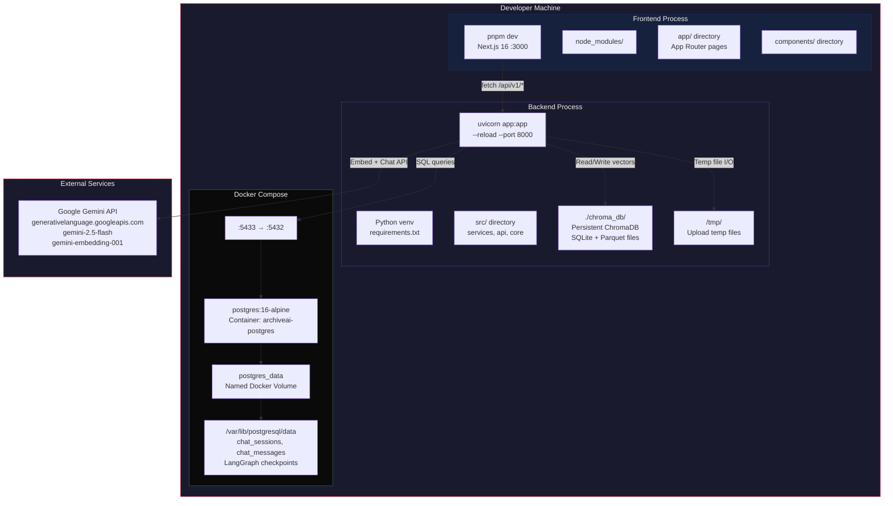

# Infrastructure & Deployment — Deployment Diagram

Shows the physical deployment architecture with Docker, ports, and data flows.

## Startup Commands

| Service | Command | Directory |
|---------|---------|-----------|
| PostgreSQL | `docker compose up postgres` | Project root |
| Backend | `uvicorn app:app --reload --port 8000` | `backend/` |
| Frontend | `pnpm dev` | `frontend/` |

## Port Mapping

| Service | Internal Port | External Port | Protocol |
|---------|--------------|---------------|----------|
| Frontend | 3000 | 3000 | HTTP |
| Backend | 8000 | 8000 | HTTP |
| PostgreSQL | 5432 | 5433 | TCP |
