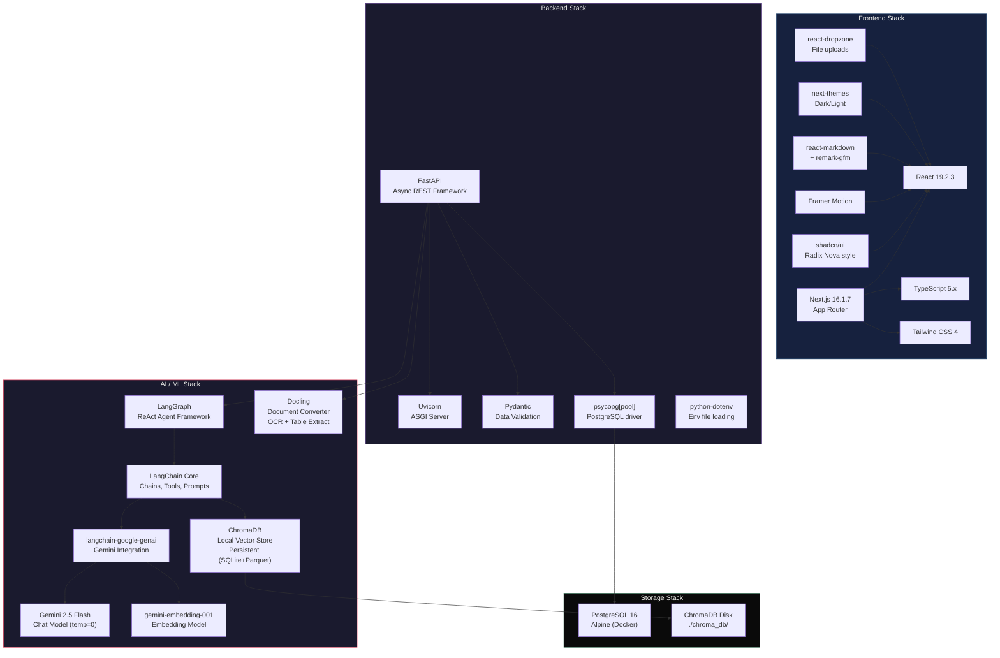

# Tech Stack Overview — Package Diagram

Shows all technologies used across the stack and their dependency relationships.

```mermaid
graph TB
    subgraph FrontendStack["Frontend Stack"]
        NextJS["Next.js 16.1.7<br/>App Router"]
        React19["React 19.2.3"]
        TypeScript["TypeScript 5.x"]
        Tailwind4["Tailwind CSS 4"]
        ShadcnUI["shadcn/ui<br/>Radix Nova style"]
        FramerMotion["Framer Motion"]
        ReactMarkdown["react-markdown<br/>+ remark-gfm"]
        NextThemes["next-themes<br/>Dark/Light"]
        ReactDropzone["react-dropzone<br/>File uploads"]
    end

    subgraph BackendStack["Backend Stack"]
        FastAPI["FastAPI<br/>Async REST Framework"]
        Uvicorn["Uvicorn<br/>ASGI Server"]
        Pydantic["Pydantic<br/>Data Validation"]
        Psycopg["psycopg[pool]<br/>PostgreSQL driver"]
        PythonDotenv["python-dotenv<br/>Env file loading"]
    end

    subgraph AIStack["AI / ML Stack"]
        LangGraph["LangGraph<br/>ReAct Agent Framework"]
        LangChain["LangChain Core<br/>Chains, Tools, Prompts"]
        GoogleGenAI["langchain-google-genai<br/>Gemini Integration"]
        GeminiFlash["Gemini 2.5 Flash<br/>Chat Model (temp=0)"]
        GeminiEmbed["gemini-embedding-001<br/>Embedding Model"]
        Chroma["ChromaDB<br/>Local Vector Store<br/>Persistent (SQLite+Parquet)"]
        Docling["Docling<br/>Document Converter<br/>OCR + Table Extract"]
    end

    subgraph StorageStack["Storage Stack"]
        PostgreSQL["PostgreSQL 16<br/>Alpine (Docker)"]
        ChromaDisk["ChromaDB Disk<br/>./chroma_db/"]
    end

    NextJS --> React19
    NextJS --> TypeScript
    NextJS --> Tailwind4
    ShadcnUI --> React19
    FramerMotion --> React19
    ReactMarkdown --> React19
    NextThemes --> React19
    ReactDropzone --> React19

    FastAPI --> Pydantic
    FastAPI --> Uvicorn
    FastAPI --> Psycopg

    LangGraph --> LangChain
    LangChain --> GoogleGenAI
    GoogleGenAI --> GeminiFlash
    GoogleGenAI --> GeminiEmbed
    LangChain --> Chroma

    FastAPI --> LangGraph
    FastAPI --> Docling
    Psycopg --> PostgreSQL
    Chroma --> ChromaDisk

    style FrontendStack fill:#16213e,stroke:#0f3460,color:#f0f0ec
    style BackendStack fill:#1a1a2e,stroke:#533483,color:#f0f0ec
    style AIStack fill:#1a1a2e,stroke:#e94560,color:#f0f0ec
    style StorageStack fill:#0a0a0a,stroke:#2d6a4f,color:#f0f0ec
```
