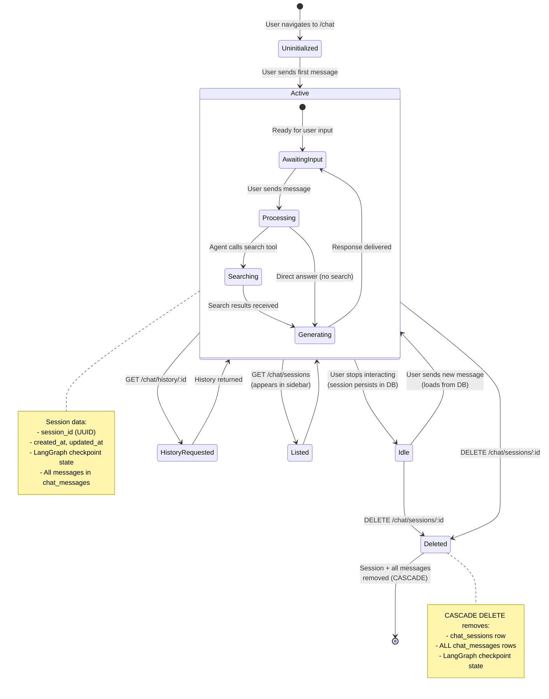

# Chat Session Lifecycle — State Diagram

Shows the lifecycle of a chat session from creation to deletion.

```mermaid
stateDiagram-v2
    [*] --> Uninitialized: User navigates to /chat

    Uninitialized --> Active: User sends first message

    state Active {
        [*] --> AwaitingInput: Ready for user input
        AwaitingInput --> Processing: User sends message
        Processing --> Searching: Agent calls search tool
        Searching --> Generating: Search results received
        Processing --> Generating: Direct answer (no search)
        Generating --> AwaitingInput: Response delivered
    }

    Active --> Idle: User stops interacting<br/>(session persists in DB)
    Idle --> Active: User sends new message<br/>(loads from DB)

    Active --> HistoryRequested: GET /chat/history/:id
    HistoryRequested --> Active: History returned

    Active --> Listed: GET /chat/sessions<br/>(appears in sidebar)
    Listed --> Active

    Idle --> Deleted: DELETE /chat/sessions/:id
    Active --> Deleted: DELETE /chat/sessions/:id
    Deleted --> [*]: Session + all messages<br/>removed (CASCADE)

    note right of Active
        Session data:
        - session_id (UUID)
        - created_at, updated_at
        - LangGraph checkpoint state
        - All messages in chat_messages
    end note

    note right of Deleted
        CASCADE DELETE removes:
        - chat_sessions row
        - ALL chat_messages rows
        - LangGraph checkpoint state
    end note
```
