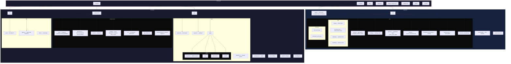

# Directory Structure — Package Diagram

Shows the complete project directory structure with purpose annotations.

```mermaid
graph TD
    subgraph Root["ArchiveAI/"]
        BackendDir["backend/"]
        FrontendDir["frontend/"]
        DocsDir["docs/"]
        DiagramsDir["diagrams/"]
        DockerCompose["docker-compose.yml"]
        ThesisMD["THESIS.md"]
        GitHubDir[".github/"]
        VSCodeDir[".vscode/"]
    end

    subgraph BackendStructure["backend/"]
        AppPy["app.py — Entry point<br/>re-exports from src/main.py"]
        EnvExample[".env.example — Env template"]
        RequirementsTxt["requirements.txt"]
        SrcDir["src/"]

        subgraph SrcContents["src/"]
            MainPy["main.py — App factory<br/>lifespan(), CORS, routers"]
            ConfigPy["config.py — Settings class"]

            subgraph API["api/"]
                ChatPy["chat.py — /chat router"]
                DocsPy["documents.py — /documents router"]
                UploadPy["upload.py — /upload router"]
                SearchPy["search.py — /search router"]
            end

            subgraph Services["services/"]
                ChatServicePy["chat_service.py"]
                DocServicePy["document_service.py"]
            end

            AgentPy["agent.py — LangGraph agent<br/>create_react_agent"]
            ToolsPy["tools.py — search_documents tool"]
            DocProcessorPy["document_processor.py — Docling"]
            VectorstorePy["vectorstore.py — ChromaDB"]
            StructureVizPy["structure_visualizer.py"]
        end
    end

    subgraph FrontendStructure["frontend/"]
        PkgJson["package.json — pnpm"]
        NextConfig["next.config.ts"]
        TailwindConfig["tailwind.config.ts"]
        TSCfg["tsconfig.json"]
        AppDirFE["app/"]

        subgraph AppDirStructure["app/"]
            RootLayoutFE["layout.tsx — Root layout"]
            LandingPageFE["page.tsx — Landing /"]
            AppGroupFE["(app)/"]
            GlobalsCSS["globals.css — Design system"]

            subgraph AppGroupStructure["(app)/"]
                AppLayoutFE["layout.tsx — Sidebar layout"]
                ChatDirFE["chat/"]
                DocsDirFE["documents/"]
                SearchDirFE["search/"]
            end
        end

        ComponentsDir["components/"]
        LibDir["lib/"]

        subgraph ComponentsStructure["components/"]
            ChatDir["chat/ — ChatArea, ChatInput, MessageBubble"]
            DocsDirComp["documents/ — DocumentUpload, DocumentTable"]
            SearchDirComp["search/ — SearchUI"]
            LandingDir["landing/ — Hero, Navigation, Features, Stats, Footer"]
            UIDir["ui/ — 14 shadcn/ui components"]
            SidebarComp["app-sidebar.tsx"]
            ThemeComp["theme-provider.tsx, theme-toggle.tsx"]
        end

        subgraph LibStructure["lib/"]
            ApiTs["api.ts — fetchApi&lt;T&gt;"]
            TypesTs["types.ts — TypeScript interfaces"]
            UtilsTs["utils.ts — cn() helper"]
        end
    end

    BackendDir --> AppPy
    BackendDir --> SrcDir
    SrcDir --> MainPy
    SrcDir --> ConfigPy
    SrcDir --> API
    SrcDir --> Services
    SrcDir --> AgentPy
    SrcDir --> ToolsPy
    SrcDir --> DocProcessorPy
    SrcDir --> VectorstorePy
    SrcDir --> StructureVizPy

    FrontendDir --> AppDirFE
    AppDirFE --> RootLayoutFE
    AppDirFE --> LandingPageFE
    AppDirFE --> AppGroupFE
    AppGroupFE --> AppLayoutFE
    AppGroupFE --> ChatDirFE
    AppGroupFE --> DocsDirFE
    AppGroupFE --> SearchDirFE

    FrontendDir --> ComponentsDir
    ComponentsDir --> ChatDir
    ComponentsDir --> DocsDirComp
    ComponentsDir --> SearchDirComp
    ComponentsDir --> LandingDir
    ComponentsDir --> UIDir

    FrontendDir --> LibDir
    LibDir --> ApiTs
    LibDir --> TypesTs

    style Root fill:#1a1a2e,stroke:#e94560,color:#f0f0ec
    style BackendStructure fill:#16213e,stroke:#0f3460,color:#f0f0ec
    style FrontendStructure fill:#1a1a2e,stroke:#533483,color:#f0f0ec
    style SrcContents fill:#0a0a0a,stroke:#2d6a4f,color:#f0f0ec
    style AppGroupStructure fill:#0a0a0a,stroke:#2d6a4f,color:#f0f0ec
    style ComponentsStructure fill:#0a0a0a,stroke:#2d6a4f,color:#f0f0ec
```
