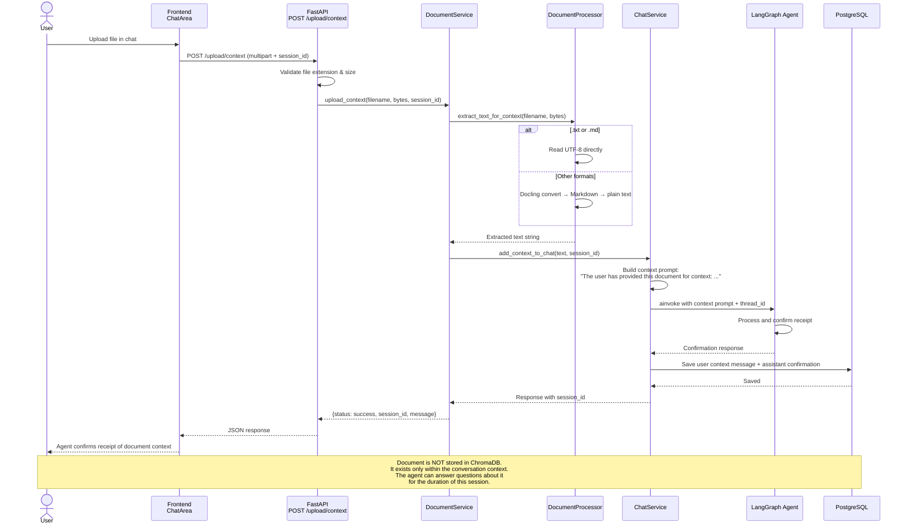

# Document Context Upload — Sequence Diagram

Shows the flow of uploading a document for in-chat context without permanent indexing.

```mermaid
sequenceDiagram
    actor User
    participant FE as Frontend<br/>ChatArea
    participant API as FastAPI<br/>POST /upload/context
    participant DS as DocumentService
    participant DP as DocumentProcessor
    participant CS as ChatService
    participant Agent as LangGraph Agent
    participant PG as PostgreSQL

    User->>FE: Upload file in chat
    FE->>API: POST /upload/context (multipart + session_id)
    API->>API: Validate file extension & size

    API->>DS: upload_context(filename, bytes, session_id)
    DS->>DP: extract_text_for_context(filename, bytes)

    alt .txt or .md
        DP->>DP: Read UTF-8 directly
    else Other formats
        DP->>DP: Docling convert → Markdown → plain text
    end

    DP-->>DS: Extracted text string

    DS->>CS: add_context_to_chat(text, session_id)
    CS->>CS: Build context prompt:<br/>"The user has provided this document for context: ..."

    CS->>Agent: ainvoke with context prompt + thread_id
    Agent->>Agent: Process and confirm receipt
    Agent-->>CS: Confirmation response

    CS->>PG: Save user context message + assistant confirmation
    PG-->>CS: Saved

    CS-->>DS: Response with session_id
    DS-->>API: {status: success, session_id, message}
    API-->>FE: JSON response
    FE-->>User: Agent confirms receipt of document context

    Note over User,PG: Document is NOT stored in ChromaDB.<br/>It exists only within the conversation context.<br/>The agent can answer questions about it<br/>for the duration of this session.
```
