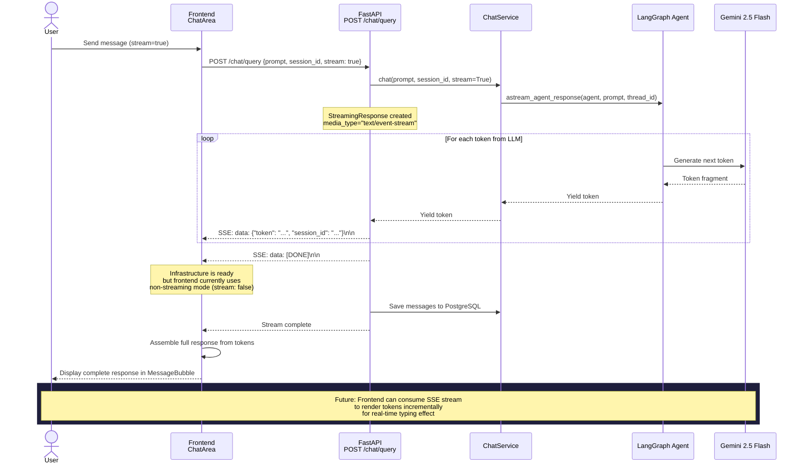

# SSE Streaming Architecture — Sequence Diagram

Shows the Server-Sent Events streaming architecture for chat responses.

```mermaid
sequenceDiagram
    actor User
    participant FE as Frontend<br/>ChatArea
    participant API as FastAPI<br/>POST /chat/query
    participant CS as ChatService
    participant Agent as LangGraph Agent
    participant LLM as Gemini 2.5 Flash

    User->>FE: Send message (stream=true)
    FE->>API: POST /chat/query {prompt, session_id, stream: true}

    API->>CS: chat(prompt, session_id, stream=True)
    CS->>Agent: astream_agent_response(agent, prompt, thread_id)

    Note over API: StreamingResponse created<br/>media_type="text/event-stream"

    loop For each token from LLM
        Agent->>LLM: Generate next token
        LLM-->>Agent: Token fragment
        Agent-->>CS: Yield token
        CS-->>API: Yield token
        API-->>FE: SSE: data: {"token": "...", "session_id": "..."}\n\n
    end

    API-->>FE: SSE: data: [DONE]\n\n

    Note over FE: Infrastructure is ready<br/>but frontend currently uses<br/>non-streaming mode (stream: false)

    API->>CS: Save messages to PostgreSQL
    API-->>FE: Stream complete

    FE->>FE: Assemble full response from tokens
    FE-->>User: Display complete response in MessageBubble

    rect rgb(30, 30, 60)
        Note over User,LLM: Future: Frontend can consume SSE stream<br/>to render tokens incrementally<br/>for real-time typing effect
    end
```
