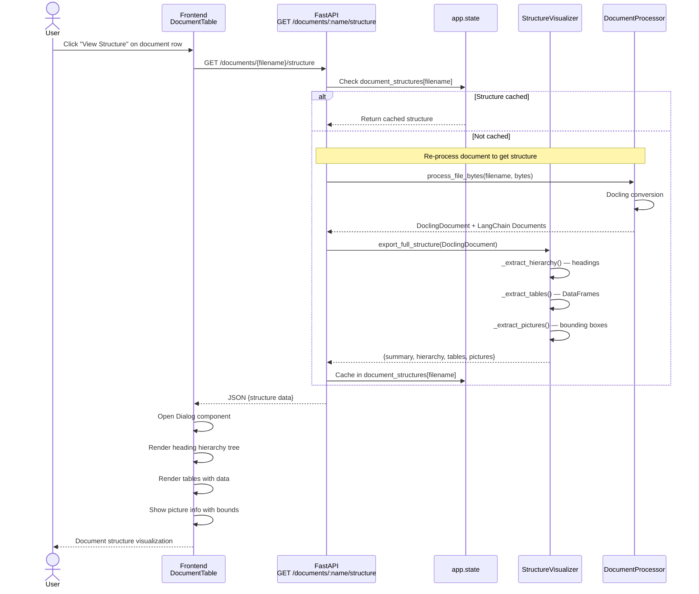

# Document Structure Visualization — Sequence Diagram

Shows how document structure is extracted and displayed when a user views a document's structure.

```mermaid
sequenceDiagram
    actor User
    participant FE as Frontend<br/>DocumentTable
    participant API as FastAPI<br/>GET /documents/:name/structure
    participant App as app.state
    participant SV as StructureVisualizer
    participant DP as DocumentProcessor

    User->>FE: Click "View Structure" on document row
    FE->>API: GET /documents/{filename}/structure

    API->>App: Check document_structures[filename]

    alt Structure cached
        App-->>API: Return cached structure
    else Not cached
        Note over API,DP: Re-process document to get structure
        API->>DP: process_file_bytes(filename, bytes)
        DP->>DP: Docling conversion
        DP-->>API: DoclingDocument + LangChain Documents
        API->>SV: export_full_structure(DoclingDocument)
        SV->>SV: _extract_hierarchy() — headings
        SV->>SV: _extract_tables() — DataFrames
        SV->>SV: _extract_pictures() — bounding boxes
        SV-->>API: {summary, hierarchy, tables, pictures}
        API->>App: Cache in document_structures[filename]
    end

    API-->>FE: JSON {structure data}
    FE->>FE: Open Dialog component
    FE->>FE: Render heading hierarchy tree
    FE->>FE: Render tables with data
    FE->>FE: Show picture info with bounds
    FE-->>User: Document structure visualization
```
