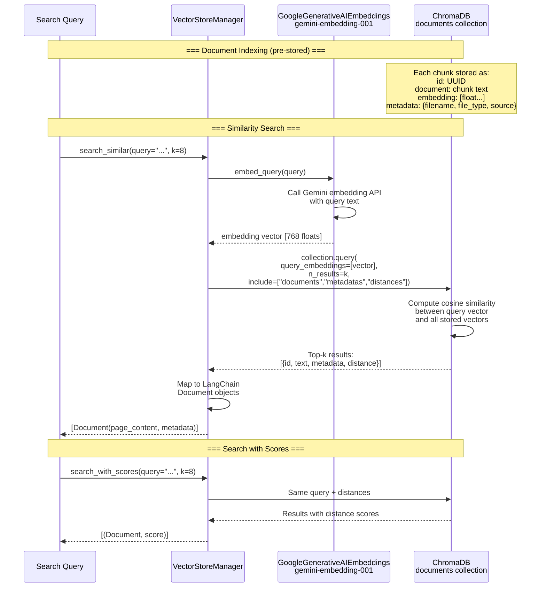

# Embedding & Similarity Search — Sequence Diagram

Shows the internal mechanics of embedding a query and performing similarity search in ChromaDB.

```mermaid
sequenceDiagram
    participant Query as Search Query
    participant VSM as VectorStoreManager
    participant Embed as GoogleGenerativeAIEmbeddings<br/>gemini-embedding-001
    participant Chroma as ChromaDB<br/>documents collection

    Note over Query,Chroma: === Document Indexing (pre-stored) ===
    Note over Chroma: Each chunk stored as:<br/>id: UUID<br/>document: chunk text<br/>embedding: [float...]<br/>metadata: {filename, file_type, source}

    Note over Query,Chroma: === Similarity Search ===

    Query->>VSM: search_similar(query="...", k=8)
    VSM->>Embed: embed_query(query)
    Embed->>Embed: Call Gemini embedding API<br/>with query text
    Embed-->>VSM: embedding vector [768 floats]

    VSM->>Chroma: collection.query(<br/>query_embeddings=[vector],<br/>n_results=k,<br/>include=["documents","metadatas","distances"])

    Chroma->>Chroma: Compute cosine similarity<br/>between query vector<br/>and all stored vectors

    Chroma-->>VSM: Top-k results:<br/>[{id, text, metadata, distance}]

    VSM->>VSM: Map to LangChain<br/>Document objects

    VSM-->>Query: [Document(page_content, metadata)]

    Note over Query,Chroma: === Search with Scores ===

    Query->>VSM: search_with_scores(query="...", k=8)
    VSM->>Chroma: Same query + distances
    Chroma-->>VSM: Results with distance scores
    VSM-->>Query: [(Document, score)]
```
