# Collaboration Diagram — ArchiveAI

Shows the structural organization of components and the sequenced messages passed between them during the three primary use cases: **Document Upload**, **Chat Query (RAG)**, and **Document Deletion**. This diagram emphasizes object relationships and message numbering rather than strict time-ordering.

```mermaid
graph TB
    subgraph Client["Client / User"]
        User("User")
    end

    subgraph Frontend["Frontend — Next.js"]
        Browser("Browser")
        ChatArea("ChatArea")
        ChatInput("ChatInput")
        MessageBubble("MessageBubble")
        DocUpload("DocumentUpload")
        DocTable("DocumentTable")
        SearchUI("SearchUI")
        AppSidebar("AppSidebar")
        ApiClient("api.ts<br/>fetchApi&lt;T&gt;")
    end

    subgraph Backend["Backend — FastAPI"]
        ChatRouter("/chat router")
        UploadRouter("/upload router")
        DocsRouter("/documents router")
        SearchRouter("/search router")

        ChatService("ChatService")
        DocService("DocumentService")

        Agent("LangGraph ReAct Agent")
        SearchTool("search_documents Tool")
        DocProcessor("DocumentProcessor")
        VSManager("VectorStoreManager")
        StructureViz("StructureVisualizer")
    end

    subgraph Storage["Storage & External"]
        PG("PostgreSQL")
        Chroma("ChromaDB")
        Gemini("Google Gemini API")
        TempFS("Temp Filesystem")
    end

    %% ============================================
    %% 1. DOCUMENT UPLOAD COLLABORATION
    %% ============================================
    User == "1: drop files" ==> DocUpload
    DocUpload == "2: POST /upload<br/>(multipart)" ==> ApiClient
    ApiClient == "3: POST /api/v1/upload" ==> UploadRouter
    UploadRouter == "4: upload_file()" ==> DocService
    DocService == "5: document_exists()" ==> VSManager
    VSManager == "6: collection.get()" ==> Chroma
    Chroma == "7: found / not found" ==> VSManager
    VSManager == "8: exists?" ==> DocService

    DocService == "9: process_file_bytes()" ==> DocProcessor
    DocProcessor == "10: write temp file" ==> TempFS
    TempFS == "11: temp_path" ==> DocProcessor
    DocProcessor == "12: Docling convert / read text" ==> DocProcessor
    DocProcessor == "13: delete temp file" ==> TempFS
    DocProcessor == "14: Documents + DoclingDoc" ==> DocService

    DocService == "15: add_documents()" ==> VSManager
    VSManager == "16: chunk & embed" ==> Gemini
    Gemini == "17: embedding vectors" ==> VSManager
    VSManager == "18: collection.add()" ==> Chroma
    Chroma == "19: stored" ==> VSManager
    VSManager == "20: indexed" ==> DocService

    DocService == "21: export_full_structure()" ==> StructureViz
    StructureViz == "22: structure data" ==> DocService
    DocService == "23: cache on app.state" ==> DocService
    DocService == "24: response JSON" ==> UploadRouter
    UploadRouter == "25: JSON response" ==> ApiClient
    ApiClient == "26: status" ==> DocUpload
    DocUpload == "27: refresh list" ==> DocTable
    DocTable == "28: GET /documents" ==> ApiClient
    DocTable == "29: render updated table" ==> User

    %% ============================================
    %% 2. CHAT QUERY (RAG) COLLABORATION
    %% ============================================
    User == "1: type & send" ==> ChatInput
    ChatInput == "2: handleSend()" ==> ChatArea
    ChatArea == "3: add user msg to state" ==> ChatArea
    ChatArea == "4: POST /chat/query" ==> ApiClient
    ApiClient == "5: POST /api/v1/chat/query" ==> ChatRouter
    ChatRouter == "6: chat(prompt, session_id)" ==> ChatService

    ChatService == "7a: INSERT session (new)" ==> PG
    ChatService == "7b: SELECT session (existing)" ==> PG
    PG == "8: session record" ==> ChatService

    ChatService == "9: INSERT user message" ==> PG
    PG == "10: saved" ==> ChatService

    ChatService == "11: ainvoke/invoke<br/>with thread_id" ==> Agent

    Agent == "12: evaluate need for context" ==> Agent
    Agent == "13: search_documents(query)" ==> SearchTool
    SearchTool == "14: search_similar(query, k=8)" ==> VSManager
    VSManager == "15: embed_query()" ==> Gemini
    Gemini == "16: embedding vector" ==> VSManager
    VSManager == "17: collection.query()" ==> Chroma
    Chroma == "18: top-k chunks" ==> VSManager
    VSManager == "19: documents with metadata" ==> SearchTool
    SearchTool == "20: formatted results + citations" ==> Agent

    Agent == "21: generate with context<br/>+ system prompt" ==> Gemini
    Gemini == "22: response tokens" ==> Agent
    Agent == "23: final response" ==> ChatService

    ChatService == "24: INSERT assistant message" ==> PG
    PG == "25: saved" ==> ChatService
    ChatService == "26: UPDATE session updated_at" ==> PG
    ChatService == "27: response JSON" ==> ChatRouter
    ChatRouter == "28: response" ==> ApiClient
    ApiClient == "29: response data" ==> ChatArea
    ChatArea == "30: add assistant msg to state" ==> ChatArea
    ChatArea == "31: render MessageBubble" ==> MessageBubble
    MessageBubble == "32: display to user" ==> User

    %% ============================================
    %% 3. DOCUMENT DELETION COLLABORATION
    %% ============================================
    User == "1: click delete" ==> DocTable
    DocTable == "2: confirm dialog" ==> DocTable
    DocTable == "3: DELETE /documents" ==> ApiClient
    ApiClient == "4: DELETE /api/v1/documents" ==> DocsRouter
    DocsRouter == "5: delete_document()" ==> DocService
    DocService == "6: delete_by_filename()" ==> VSManager
    VSManager == "7: collection.get()" ==> Chroma
    Chroma == "8: matching IDs" ==> VSManager
    VSManager == "9: collection.delete()" ==> Chroma
    Chroma == "10: deleted" ==> VSManager
    VSManager == "11: success" ==> DocService
    DocService == "12: response JSON" ==> DocsRouter
    DocsRouter == "13: JSON response" ==> ApiClient
    ApiClient == "14: status" ==> DocTable
    DocTable == "15: refresh list" ==> DocTable
    DocTable == "16: render updated table" ==> User

    %% ============================================
    %% 4. SEMANTIC SEARCH COLLABORATION
    %% ============================================
    User == "1: enter query" ==> SearchUI
    SearchUI == "2: POST /search" ==> ApiClient
    ApiClient == "3: POST /api/v1/search" ==> SearchRouter
    SearchRouter == "4: search_with_scores()" ==> VSManager
    VSManager == "5: embed_query()" ==> Gemini
    Gemini == "6: embedding vector" ==> VSManager
    VSManager == "7: collection.query()" ==> Chroma
    Chroma == "8: results with scores" ==> VSManager
    VSManager == "9: [(Document, score)]" ==> SearchRouter
    SearchRouter == "10: JSON results" ==> ApiClient
    ApiClient == "11: results" ==> SearchUI
    SearchUI == "12: render result cards" ==> User

    %% ============================================
    %% 5. APP STARTUP COLLABORATION (Background)
    %% ============================================
    Uvicorn("Uvicorn") -. "1: start app" .-> Lifespan("lifespan()")
    Lifespan -. "2: load Settings" .-> Settings("config.Settings")
    Lifespan -. "3: create ConnectionPool" .-> PG
    Lifespan -. "4: create PostgresSaver" .-> PG
    Lifespan -. "5: create DocumentProcessor" .-> DocProcessor
    Lifespan -. "6: create VectorStoreManager" .-> VSManager
    VSManager -. "7: load Chroma collection" .-> Chroma
    Lifespan -. "8: create DocumentService" .-> DocService
    Lifespan -. "9: create ChatService" .-> ChatService
    Lifespan -. "10: store on app.state" .-> Backend

    %% Styles
    style User fill:#e94560,stroke:#0a0a0a,color:#f0f0ec
    style Client fill:#1a1a2e,stroke:#e94560,color:#f0f0ec
    style Frontend fill:#16213e,stroke:#0f3460,color:#f0f0ec
    style Backend fill:#1a1a2e,stroke:#533483,color:#f0f0ec
    style Storage fill:#0a0a0a,stroke:#2d6a4f,color:#f0f0ec
```

## Collaboration Paths Explained

This diagram shows **four primary use-case collaborations** and one **background initialization**:

### 1. Document Upload (messages 1–29)
- **Path**: User → DocumentUpload → api.ts → /upload router → DocumentService → DocumentProcessor + VectorStoreManager → ChromaDB + Gemini API
- **Key collaboration**: DocumentService orchestrates DocProcessor for conversion and VSManager for embedding/indexing. The result is cached in `app.state.document_structures`.

### 2. Chat Query with RAG (messages 1–32)
- **Path**: User → ChatInput → ChatArea → api.ts → /chat router → ChatService → LangGraph Agent → search_documents Tool → VectorStoreManager → ChromaDB + Gemini API
- **Key collaboration**: The Agent decides whether to retrieve context. If needed, the SearchTool queries VSManager, which embeds the query and searches ChromaDB. Results flow back through the chain to the Agent for response generation.

### 3. Document Deletion (messages 1–16)
- **Path**: User → DocumentTable → api.ts → /documents router → DocumentService → VectorStoreManager → ChromaDB
- **Key collaboration**: Simple but critical — VSManager queries ChromaDB for IDs by filename, then deletes those chunks atomically.

### 4. Semantic Search (messages 1–12)
- **Path**: User → SearchUI → api.ts → /search router → VectorStoreManager → Gemini API → ChromaDB
- **Key collaboration**: Direct query embedding and similarity search without Agent involvement, returning scored results to the UI.

### 5. App Startup (background, dotted lines)
- **Path**: Uvicorn → lifespan() → Settings → PostgreSQL → DocumentProcessor → VectorStoreManager → DocumentService → ChatService → app.state
- **Key collaboration**: The lifespan context manager bootstraps all singleton services, applies graceful degradation (PostgresSaver → MemorySaver fallback), and injects dependencies into FastAPI's `app.state`.

## Diagram Conventions

- **Solid lines (`==>`)**: Synchronous request/response messages in the active use-case flow.
- **Dotted lines (`.->`)**: Background initialization and configuration dependencies.
- **Message numbers**: Show the approximate sequence within each use case, not global ordering.
- **Double arrows (`==>`)**: Emphasize the primary collaboration paths (vs. single `->` for secondary links).
- **Self-loops**: Components that perform internal operations (e.g., Agent evaluating context need, DocProcessor converting formats).

## Comparison to Sequence Diagrams

| Aspect | Collaboration Diagram (this) | Sequence Diagrams (06–09, 26–29) |
|--------|------------------------------|----------------------------------|
| **Focus** | Structural relationships between objects | Time-ordered message flow |
| **Layout** | Objects grouped by layer/subsystem | Objects arranged horizontally by role |
| **Best for** | Understanding *who talks to whom* | Understanding *when things happen* |
| **Readability** | Better for seeing overall coupling | Better for tracing step-by-step logic |

## Related Diagrams

- [Document Upload Sequence](./06-sequence-document-upload.md) — Time-ordered upload flow
- [Chat Query Sequence](./07-sequence-chat-query.md) — Time-ordered RAG chat flow
- [Document Deletion Sequence](./08-sequence-document-deletion.md) — Time-ordered deletion flow
- [App Startup Sequence](./09-sequence-app-startup.md) — Initialization and shutdown lifecycle
- [System Overview](./01-system-overview.md) — High-level component map
- [Backend Class Diagram](./10-class-diagram-backend.md) — Class attributes and methods
