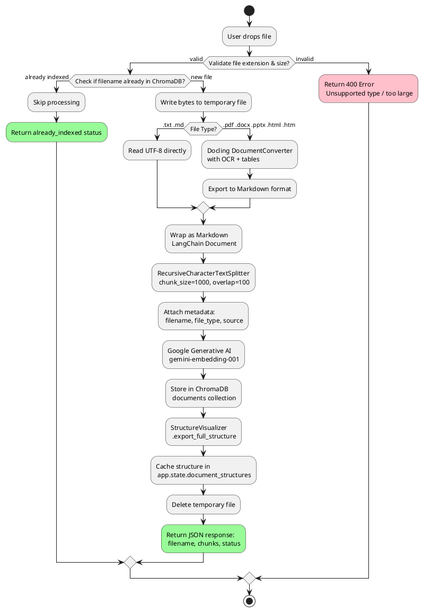
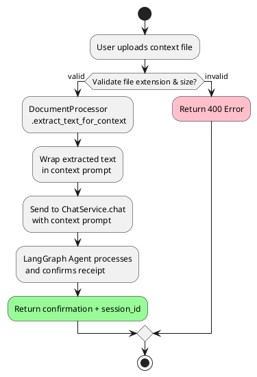
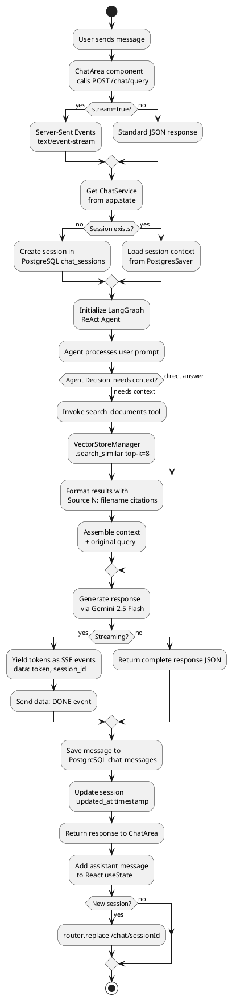
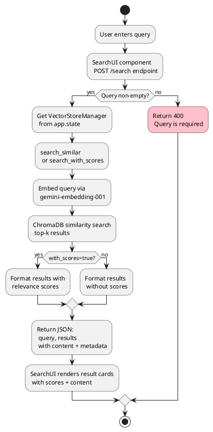

# Activity Diagrams - ArchiveAI (PlantUML)

Activity diagrams for the three primary workflows: document processing, chat RAG pipeline, and semantic search.

Sources: `diagrams/03-activity-document-processing.md`, `diagrams/04-activity-chat-rag.md`, `diagrams/05-activity-semantic-search.md`

---

## 1. Document Processing Activity Diagram

Shows the detailed flow of document upload, processing, chunking, embedding, and indexing.

Source: `diagrams/03-activity-document-processing.md`

### Main Flow (Indexed Upload)

### Context Upload Flow (Non-Indexed)

---

## 2. Chat & RAG Pipeline Activity Diagram

Shows the detailed flow of a chat query through the RAG agent pipeline.

Source: `diagrams/04-activity-chat-rag.md`

---

## 3. Semantic Search Activity Diagram

Shows the flow of a direct semantic search query (not through the chat agent).

Source: `diagrams/05-activity-semantic-search.md`

