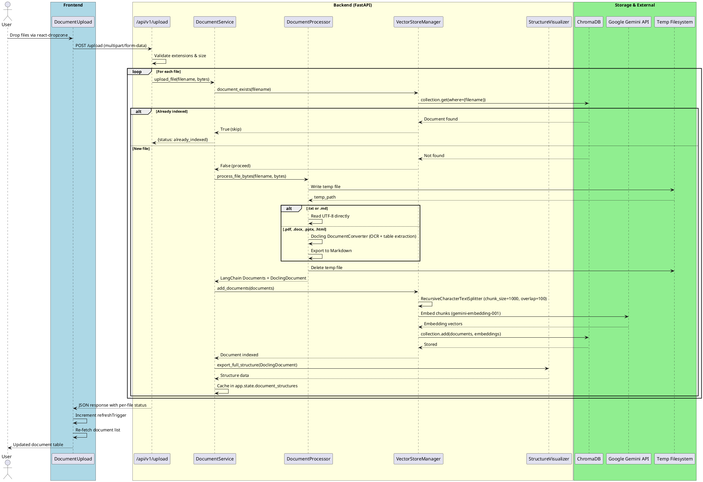
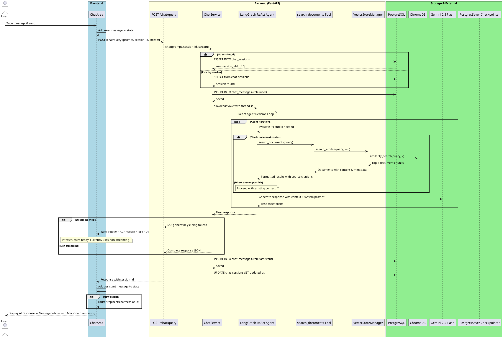
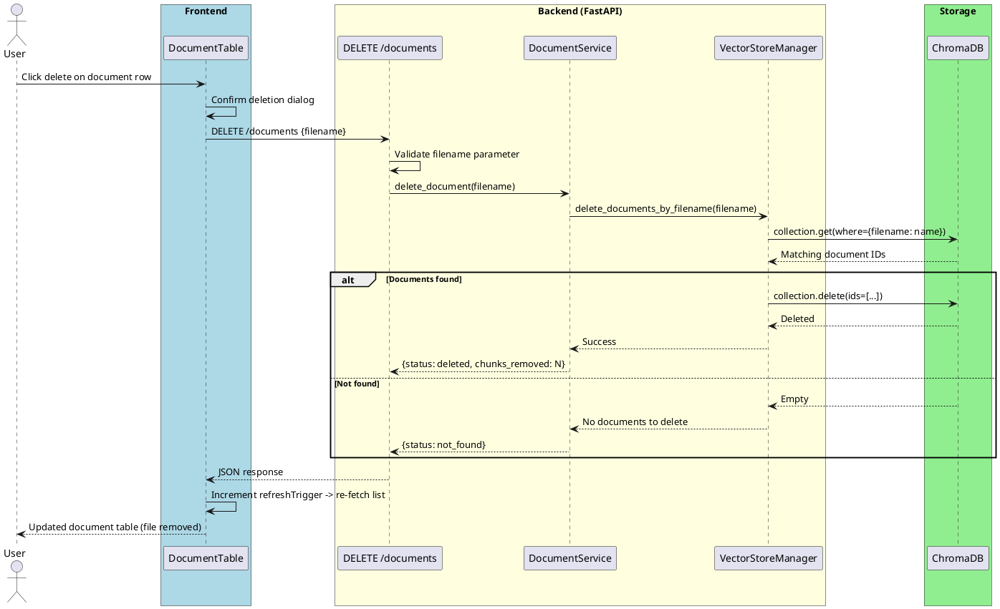
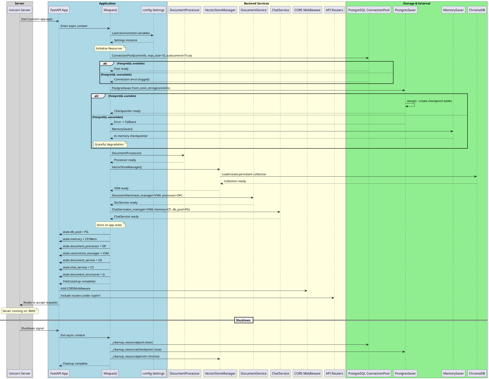
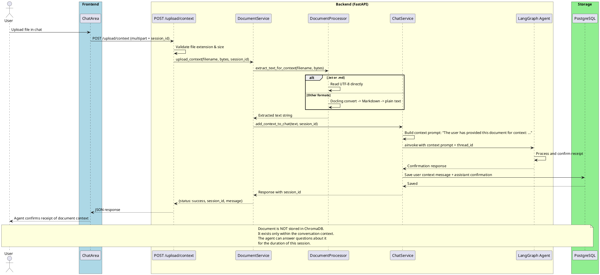
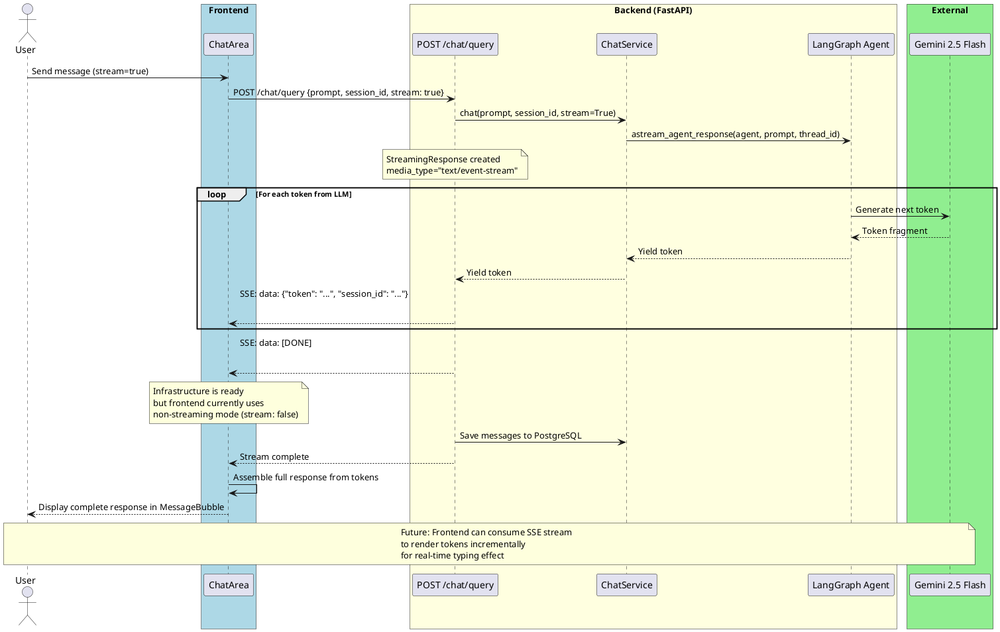
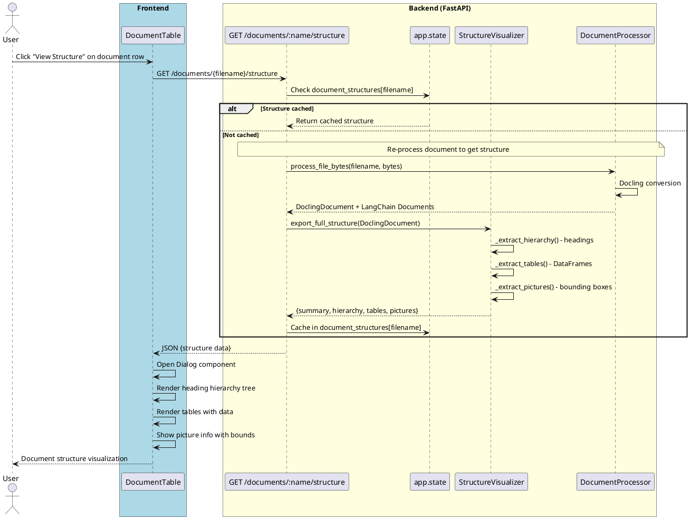
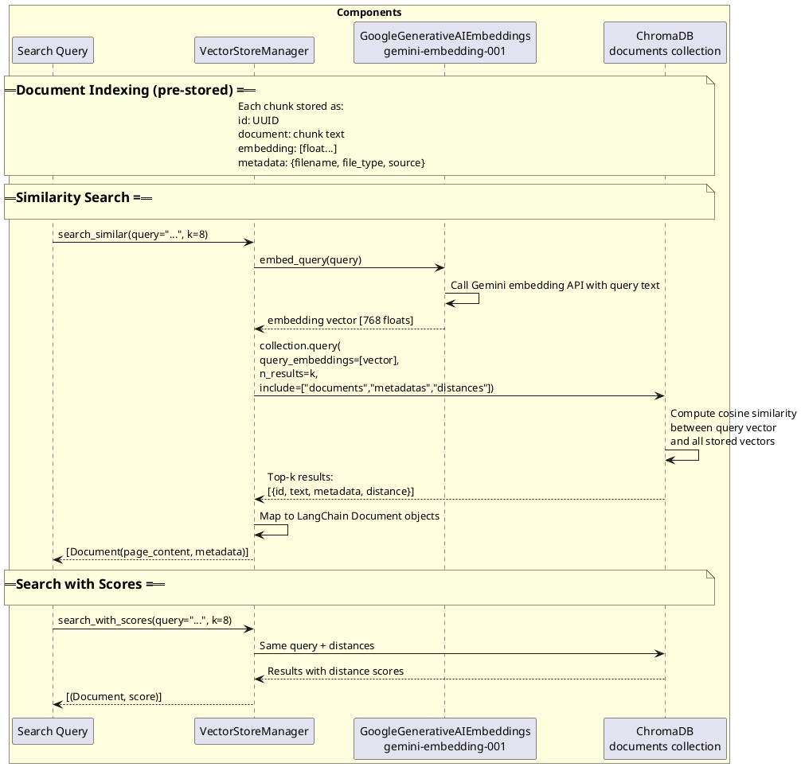

# Sequence Diagrams - ArchiveAI (PlantUML)

Sequence diagrams for time-ordered interactions between components across eight scenarios.

Sources: `diagrams/06` through `diagrams/09`, and `diagrams/26` through `diagrams/29`.

---

## 1. Document Upload Sequence

Shows the interactions between frontend, backend services, and storage during file upload.

Source: `diagrams/06-sequence-document-upload.md`

---

## 2. Chat Query Sequence

Shows the interactions during a chat query through the RAG agent pipeline.

Source: `diagrams/07-sequence-chat-query.md`

---

## 3. Document Deletion Sequence

Shows the interactions when deleting an indexed document.

Source: `diagrams/08-sequence-document-deletion.md`

---

## 4. App Startup Sequence

Shows the application startup lifecycle, resource initialization, and graceful shutdown.

Source: `diagrams/09-sequence-app-startup.md`

---

## 5. Context Upload Sequence

Shows the flow of uploading a document for in-chat context without permanent indexing.

Source: `diagrams/26-sequence-context-upload.md`

---

## 6. SSE Streaming Sequence

Shows the Server-Sent Events streaming architecture for chat responses.

Source: `diagrams/27-sequence-sse-streaming.md`

---

## 7. Structure Visualization Sequence

Shows how document structure is extracted and displayed when a user views a document's structure.

Source: `diagrams/28-sequence-structure-visualization.md`

---

## 8. Embedding & Similarity Search Sequence

Shows the internal mechanics of embedding a query and performing similarity search in ChromaDB.

Source: `diagrams/29-sequence-embedding-search.md`

