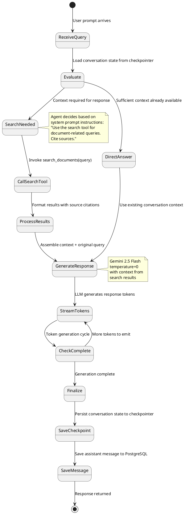
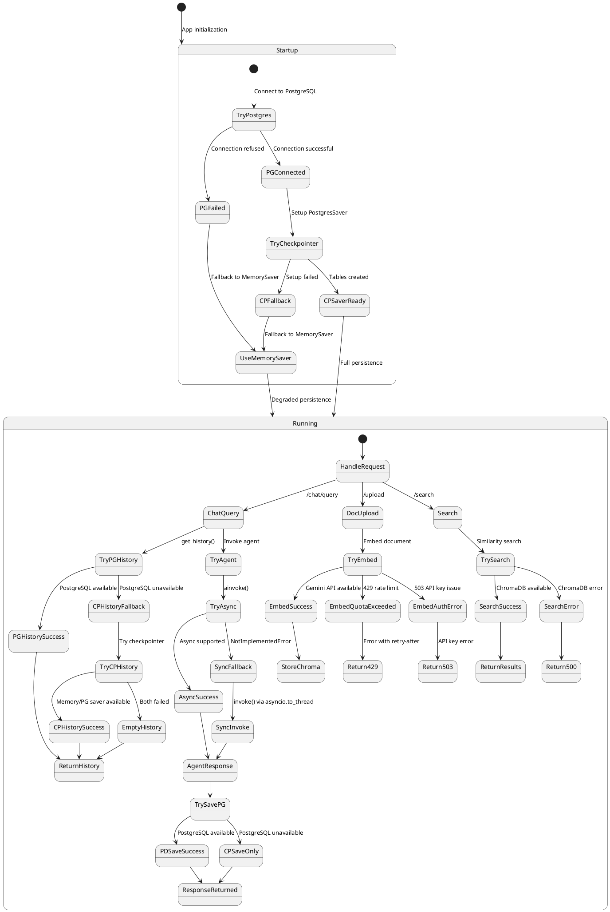
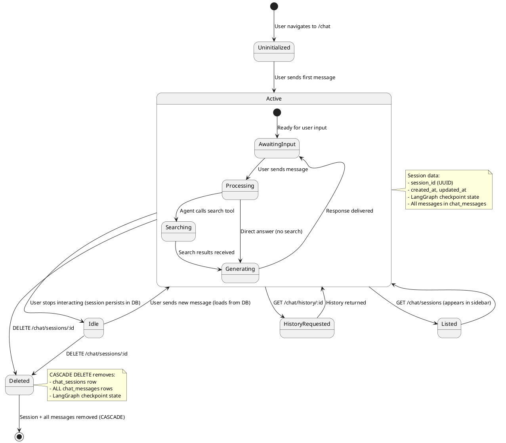

# State Machine Diagrams - ArchiveAI (PlantUML)

State diagrams for object lifecycles: RAG agent internal state, graceful degradation, and chat session lifecycle.

Sources: `diagrams/14-state-diagram-rag-agent.md`, `diagrams/15-state-diagram-fallback.md`, `diagrams/23-chat-session-lifecycle.md`

---

## 1. RAG Agent Internal State Machine

Shows the LangGraph ReAct agent's internal state transitions during query processing.

Source: `diagrams/14-state-diagram-rag-agent.md`

---

## 2. Graceful Degradation & Fallback State Machine

Shows how the system handles failures and degrades gracefully.

Source: `diagrams/15-state-diagram-fallback.md`

---

## 3. Chat Session Lifecycle State Machine

Shows the lifecycle of a chat session from creation to deletion.

Source: `diagrams/23-chat-session-lifecycle.md`

