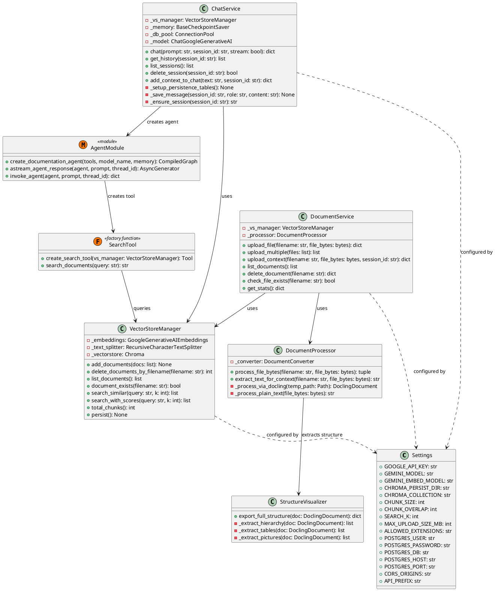

# Class Diagram - ArchiveAI Backend (PlantUML)

Shows the main backend classes, their attributes, methods, and relationships.

Source: `diagrams/10-class-diagram-backend.md`

## Diagram

## Class Descriptions

### Settings
Configuration class holding all environment-driven settings. Singleton-like instance loaded at startup via `lifespan()`. All service classes depend on its values (PostgreSQL connection params, Gemini API key, ChromaDB directory, chunking parameters, CORS origins, API prefix).

### DocumentProcessor
Wraps Docling's `DocumentConverter` to convert uploaded files to LangChain `Document` objects. Handles two paths:
- Plain text (`.txt`, `.md`) - read UTF-8 directly
- Binary formats (`.pdf`, `.docx`, `.pptx`, `.html`) - Docling conversion with OCR + table extraction, then export to Markdown

### VectorStoreManager
Manages the ChromaDB vector store and the Google Generative AI embeddings model. Provides methods for adding documents (with chunking via `RecursiveCharacterTextSplitter`), deleting by filename, listing, similarity search (with or without scores), and deduplication checks.

### StructureVisualizer
Extracts structural information (headings hierarchy, tables as DataFrames, pictures with bounding boxes) from a `DoclingDocument` and returns it as a JSON-serializable dictionary.

### DocumentService
Service layer orchestrating `DocumentProcessor` and `VectorStoreManager` for file uploads (single, multiple, and context-only), document listing, deletion, existence checks, and stats retrieval.

### ChatService
Service layer for chat functionality. Manages PostgreSQL-backed chat sessions and messages, invokes the LangGraph ReAct agent with checkpointer-based persistence, and supports both sync and streaming responses. Falls back to `MemorySaver` if PostgreSQL is unavailable.

### AgentModule
Module providing factory functions for creating and invoking the LangGraph documentation agent. Creates the ReAct agent with tools, model, and memory, and exposes both async streaming and sync invocation methods.

### SearchTool
Factory function that creates a `search_documents` tool bound to a specific `VectorStoreManager` instance. The tool is used by the LangGraph agent to retrieve relevant document chunks based on the user's query.

## Relationships

| From | To | Type | Description |
|------|----|----|-------------|
| DocumentService | VectorStoreManager | Dependency (`-->`) | Uses VSM for indexing, listing, deletion |
| DocumentService | DocumentProcessor | Dependency (`-->`) | Uses DP for file conversion |
| ChatService | VectorStoreManager | Dependency (`-->`) | Uses VSM for search tool binding |
| ChatService | AgentModule | Dependency (`-->`) | Creates the LangGraph agent |
| AgentModule | SearchTool | Dependency (`-->`) | Creates the search tool for the agent |
| SearchTool | VectorStoreManager | Dependency (`-->`) | Queries VSM at runtime |
| DocumentProcessor | StructureVisualizer | Dependency (`-->`) | Extracts structure during processing |
| VectorStoreManager | Settings | Dependency (`..>`) | Configured by Settings |
| ChatService | Settings | Dependency (`..>`) | Configured by Settings |
| DocumentService | Settings | Dependency (`..>`) | Configured by Settings |
