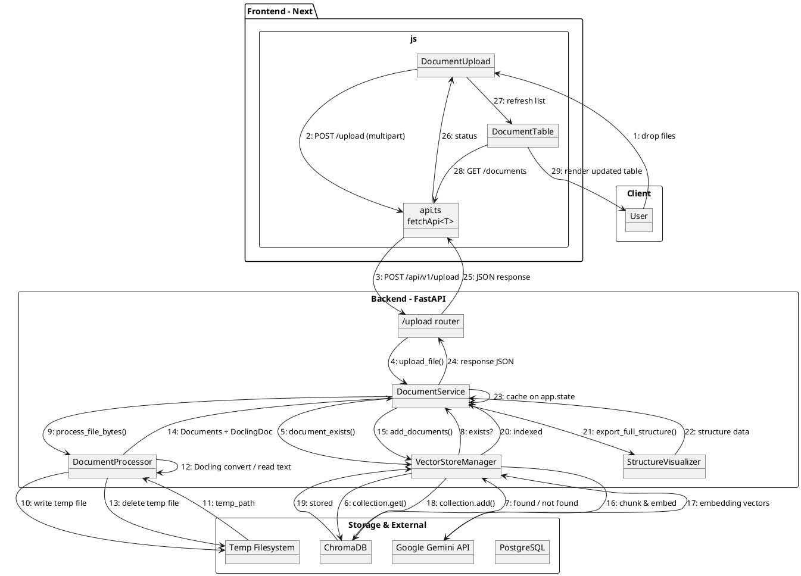
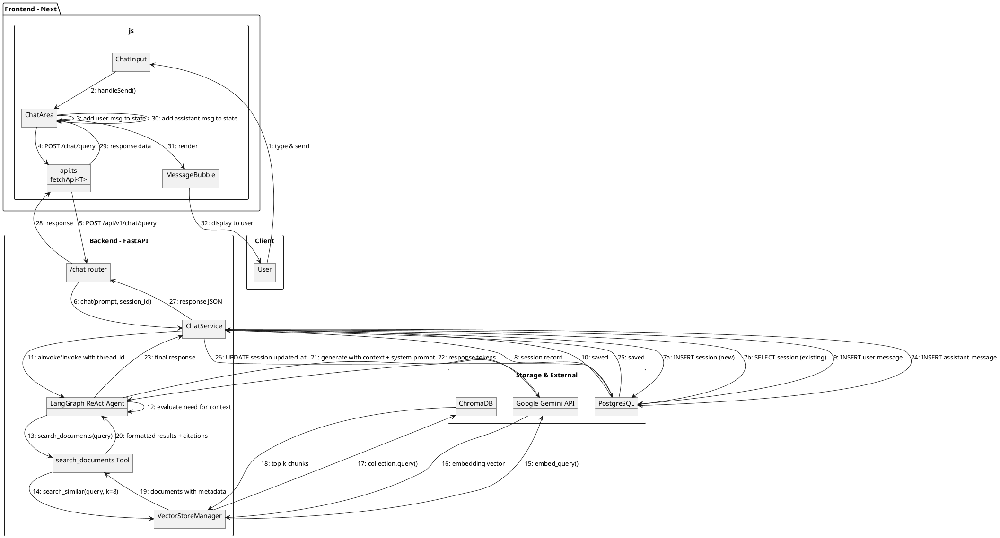
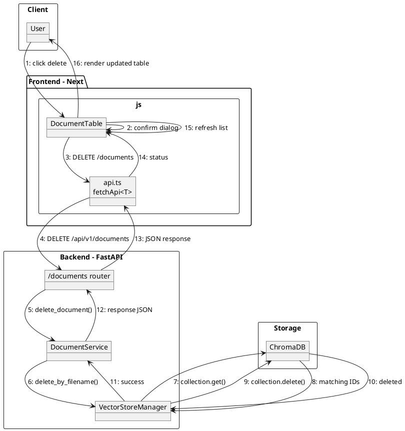
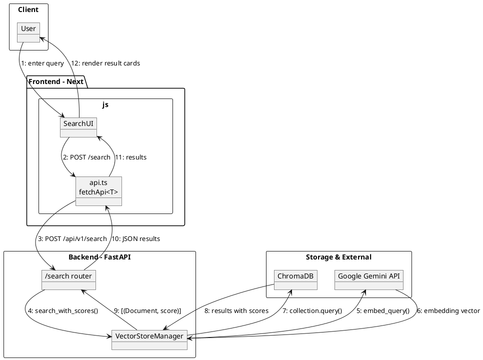
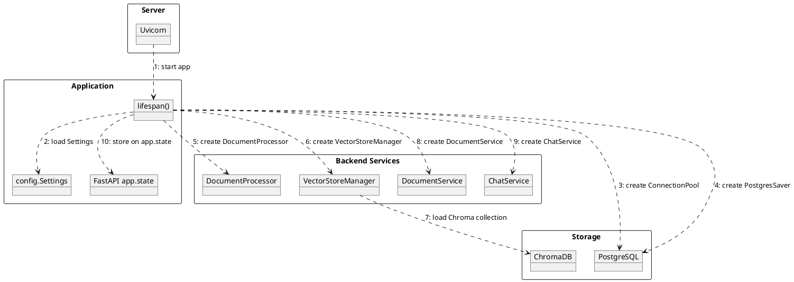

# Collaboration Diagrams - ArchiveAI (PlantUML)

Shows the structural organization of components and the sequenced messages passed between them during the five primary use cases. PlantUML does not have a native "collaboration/communication diagram" type, so these use object/instance notation with numbered message labels on graph-styled links, which visually matches a UML collaboration diagram.

Source: `diagrams/30-collaboration-diagram.md`

## Diagram Conventions

- **Solid arrows (`-->`)**: Synchronous request/response messages in the active use-case flow
- **Dotted arrows (`..>`)**: Background initialization and configuration dependencies
- **Numbered labels (`1:`, `2:`, ...)**: Show the approximate sequence within each use case
- **Subsystem grouping (`rectangle`)**: Objects grouped by layer (Client, Frontend, Backend, Storage)

---

## 1. Document Upload Collaboration

Path: User -> DocumentUpload -> api.ts -> /upload router -> DocumentService -> DocumentProcessor + VectorStoreManager -> ChromaDB + Gemini API

---

## 2. Chat Query (RAG) Collaboration

Path: User -> ChatInput -> ChatArea -> api.ts -> /chat router -> ChatService -> LangGraph Agent -> search_documents Tool -> VectorStoreManager -> ChromaDB + Gemini API

---

## 3. Document Deletion Collaboration

Path: User -> DocumentTable -> api.ts -> /documents router -> DocumentService -> VectorStoreManager -> ChromaDB

---

## 4. Semantic Search Collaboration

Path: User -> SearchUI -> api.ts -> /search router -> VectorStoreManager -> Gemini API -> ChromaDB

---

## 5. App Startup Collaboration (Background)

Path: Uvicorn -> lifespan() -> Settings -> PostgreSQL -> DocumentProcessor -> VectorStoreManager -> DocumentService -> ChatService -> app.state

---

## Comparison to Sequence Diagrams

| Aspect | Collaboration Diagrams (this file) | Sequence Diagrams (03-sequence-diagrams.md) |
|--------|------------------------------------|---------------------------------------------|
| **Focus** | Structural relationships between objects | Time-ordered message flow |
| **Layout** | Objects grouped by layer/subsystem | Objects arranged horizontally by role |
| **Best for** | Understanding *who talks to whom* | Understanding *when things happen* |
| **Readability** | Better for seeing overall coupling | Better for tracing step-by-step logic |

## Related Diagrams

- [Use Case Diagram](./01-use-case.md) - Actors and system interactions
- [Activity Diagrams](./02-activity-diagrams.md) - Workflow and process flows
- [Sequence Diagrams](./03-sequence-diagrams.md) - Time-ordered interactions
- [State Machine Diagrams](./04-state-machine-diagrams.md) - Object lifecycles
- [Class Diagram](./05-class-diagram.md) - Class attributes, methods, and relationships
